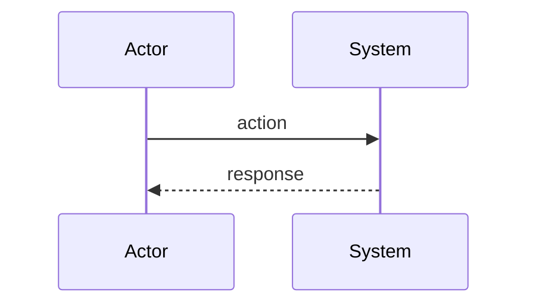

# Feature Name

## Goals
Describe what this feature/spec aims to achieve. Why is it needed?

## Criterias
- Acceptance criteria or constraints for the implementation
- List each criterion as a bullet point
- Use this section to define what "done" looks like

## Usage
Describe how the feature is used. Include:
- Library/crate choice and rationale
- Environment variable configuration (if applicable)
- Integration points with existing code

Draft of envars:
- ENVAR_NAME
    - Type
    - Description
    - Default value

## Flow
Describe the flow using Mermaid diagrams. Include:
- Sequence diagrams for request/response flows
- Flowcharts for decision logic
- Cover both happy path and error/edge cases

### Scenario name

## References
- [Link to documentation](https://example.com)
- [Link to crate/repo](https://example.com)
