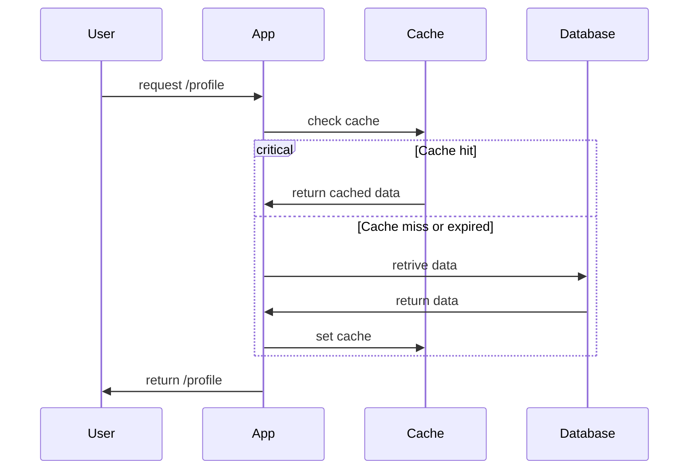
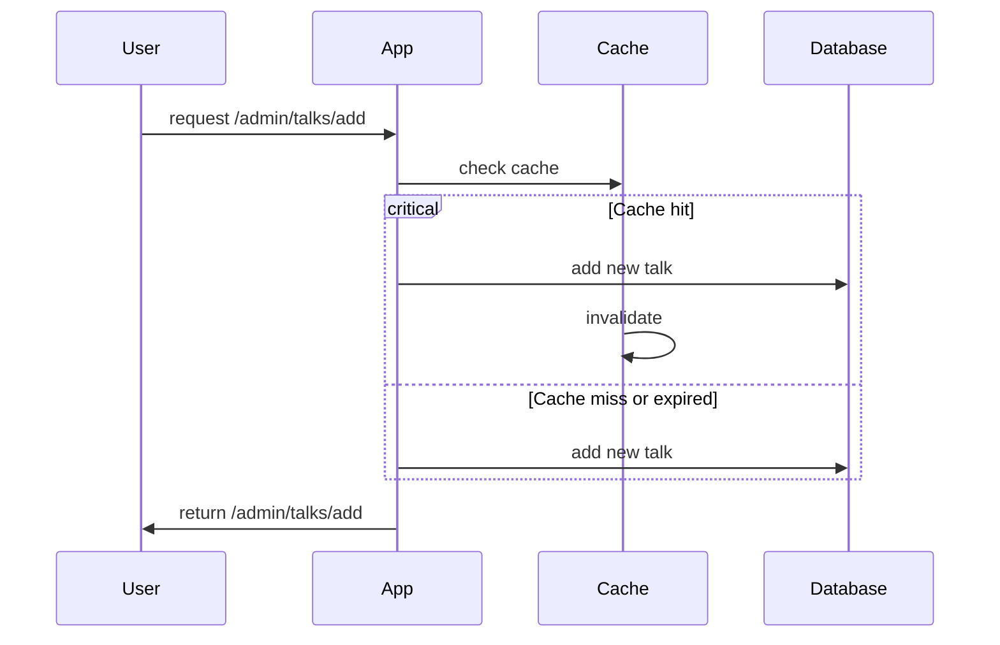

# Caching

## Goals
Implement in-memory caching to reduce latency from DB -> App while maintain
data concistency by correctly implement Cache.

## Criterias
- Cache configurations such as cache type and cache timeout should be configurable via environment variable (envar/s)
- Public endpoints cache implementation follow this flow get data, store in cache, invalidate after timeout, and get the latest data
- Auth-protected endpoints cache implementation should be followed by imediate update when we add, update, or delete data

## Usage
The in-memory cache is suitable for the initial iteration since we don't have
to add another infrastructure resources.
[Moka](https://github.com/moka-rs/moka) is one of the most common cache library
available in Rust. We can try to use this for the initial phase.

Cache is enabled with envar such as `IS_CACHE_ENABLED` that declared as 
a mandatory envar. The other configurations envars such as `CACHE_TYPE`,
`CACHE_TIMEOUT_SECOND`, etc should be declared as optional
envars and evalueated when the `IS_CACHE_ENABLED` is enabled.

Draft of envars:
- IS_CACHE_ENABLED
    - Boolean
    - Enable/Disable Cache
- CACHE_TYPE
    - String
    - Choose Cache types. Currently we only provide `in-memory` type. We can add `redis` later
    - Default to `in-memory`
- CACHE_TIMEOUT_SECOND
    - number
    - Cache timeout duration in second
    - Default to 3600

## Flow

### Profile endpoint example

### Talk Admin endpoint example

## References
