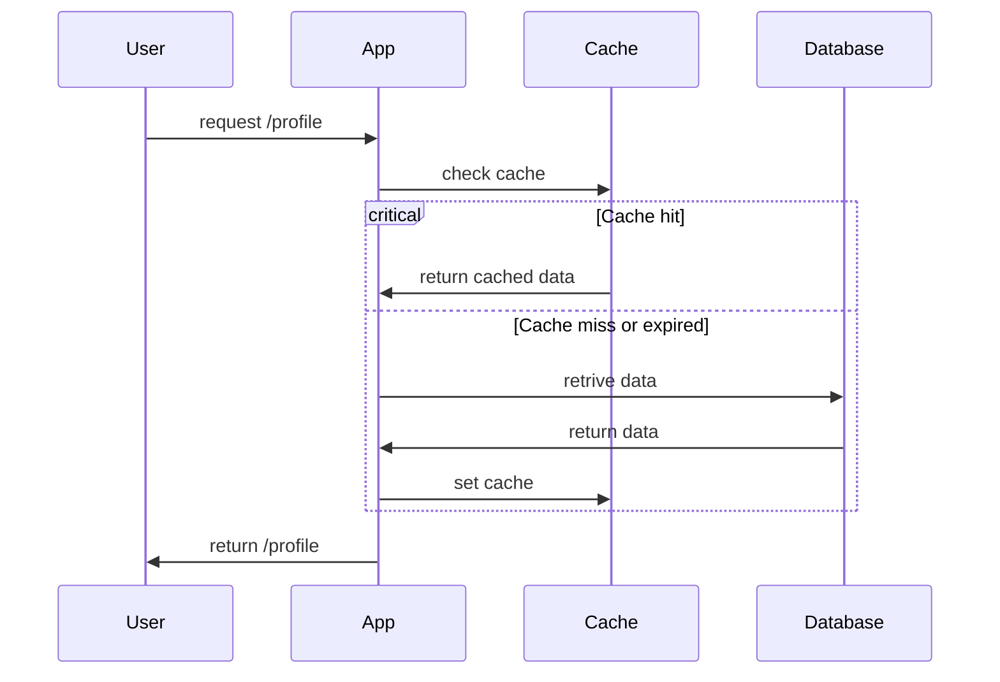
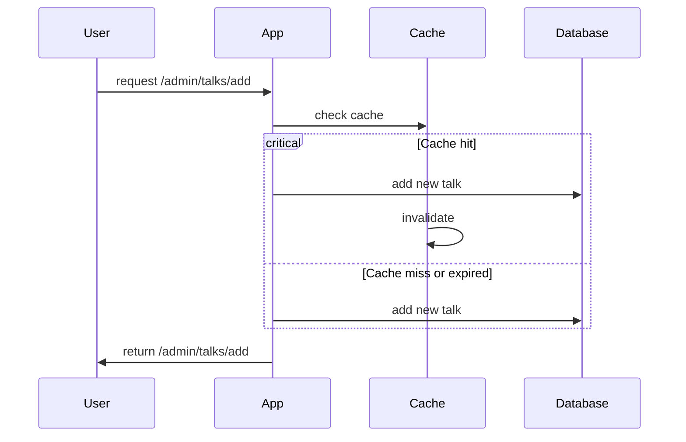

# Caching

## Goals
Implement in-memory caching to reduce latency from DB -> App while maintaining
data consistency by correctly implementing cache invalidation.

## Criterias
- Cache type and TTL are configurable via environment variables
- Cache is **disabled by default** (enabled by setting `CACHE_TYPE`)
- Public endpoints: get data, store in cache, invalidate after TTL, refresh
- Auth-protected endpoints: immediate invalidation on add/update/delete

## Usage
The in-memory cache is suitable for the initial iteration since we don't have
to add another infrastructure resources.
[Moka](https://github.com/moka-rs/moka) is one of the most common cache library
available in Rust. We can try to use this for the initial phase.

### Env vars
- `CACHE_TYPE`
    - Optional string
    - Currently supports `InMemory`. Absent means cache is disabled.
    - Default: `None` (disabled)
- `CACHE_TTL`
    - Optional number (seconds)
    - Cache timeout duration. **Required** when `CACHE_TYPE` is set, otherwise `unwrap()` panics at startup.
    - Default: no default (must be set if cache is enabled)

## Flow

### Profile endpoint example

```mermaid
%% Profile request/response
sequenceDiagram
    User->>App: request /profile
    App->>Cache: check cache
    critical Cache hit
        Cache->>App: return cached data
    option Cache miss or expired
        App->>Database: retrive data
        Database->>App: return data
        App->>Cache: set cache
    end
    App->>User: return /profile
```

### Talk Admin endpoint example

```mermaid
%% Talk Admin GET request
sequenceDiagram
    User->>App: request /admin/talks
    App->>Cache: check cache
    critical Cache hit
        Cache->>App: return cached data
    option Cache miss or expired
        App->>Database: retrive data
        Database->>App: return data
        App->>Cache: set cache
    end
    App->>User: return /admin/talks
```

```mermaid
%% Talk Admin Add POST request
sequenceDiagram
    User->>App: request /admin/talks/add
    App->>Cache: check cache
    critical Cache hit
        App->>Database: add new talk
        Cache->>Cache: invalidate
    option Cache miss or expired
        App->>Database: add new talk
    end
    App->>User: return /admin/talks/add
```

## References
