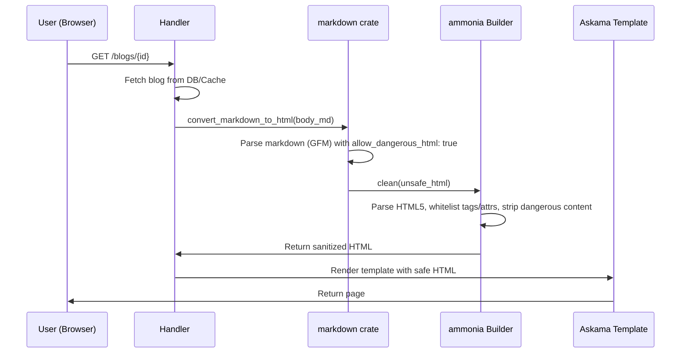

# XSS Sanitization

## Goals
Prevent cross-site scripting (XSS) attacks by sanitizing HTML output from the markdown
compiler while keeping `allow_dangerous_html: true` enabled. This preserves the ability
to embed raw HTML (e.g., `<div style="overflow-x: auto;">` for table overflow) while
blocking dangerous payloads like `<script>`, event handlers, and `javascript:` URIs.

## Criterias
- `allow_dangerous_html: true` remains enabled in the markdown compiler (`src/utils.rs:41`)
- All markdown-to-HTML output is sanitized before rendering in Askama templates
- Safe HTML tags used in blog content are preserved: `<div>`, `<table>`, `<pre>`, `<code>`, `<span>`, `<a>`, ``, etc.
- Dangerous tags are stripped: `<script>`, `<style>`, `<iframe>`, `<object>`, `<embed>`, `<form>`, `<input>`, `<textarea>`, `<select>`
- Dangerous attributes are stripped: `on*` event handlers (`onclick`, `onerror`, `onload`, etc.)
- Dangerous URL schemes in `href`/`src` are stripped: `javascript:`, `data:`, `vbscript:`
- Blog note about using `<div style="overflow-x: auto;">` for table overflow continues to work

## Usage
[Ammonia](https://github.com/rust-ammonia/ammonia) is a whitelist-based HTML sanitizer
built on `html5ever` (the same HTML parser used in browsers). It parses input according
to the HTML5 specification, making it resilient to syntactic obfuscation that could
bypass regex-based sanitizers.

Add `ammonia` to `Cargo.toml`:
```toml
[dependencies]
ammonia = "4.1.3"
```

Ammonia is configured with a `Builder` to define which tags and attributes are allowed.
The sanitizer is applied as the final step in `convert_markdown_to_html()` after the
`markdown` crate produces raw HTML.

### Default ammonia behavior (relevant to our use case)
- Strips `<script>`, `<style>`, and their contents entirely
- Strips `on*` event handler attributes from all tags
- Allows common safe tags: `<a>`, `<p>`, `<div>`, `<span>`, `<table>`, `<tr>`, `<td>`,
  `<th>`, `<pre>`, `<code>`, `<h1>`-`<h6>`, `<strong>`, `<em>`, `<del>`, `<ul>`, `<ol>`,
  `<li>`, ``, `<blockquote>`, `<hr>`, etc.
- Blocks `javascript:` and `data:` URL schemes in `href`/`src` by default
- Adds `rel="noopener noreferrer"` to external links by default (can be disabled)

### Custom Builder configuration
A static `Builder` instance should be created with:
- `url_relative(UrlRelative::PassThrough)` — preserve relative URLs as-is
- `link_rel(None)` — do not force `rel="noopener noreferrer"` on links (since blog
  content links are not user-submitted)
- `add_clean_content_tags(&["script", "style"])` — strip contents of script/style tags
  (this is also the default, but makes intent explicit)

## Flow

### Markdown rendering pipeline



### Sanitization examples

| Input (markdown HTML output) | After ammonia | Result |
|---|---|---|
| `<div style="overflow-x: auto;">table</div>` | `<div style="overflow-x: auto;">table</div>` | Safe tag preserved |
| `<script>alert('xss')</script>` | (empty) | Stripped entirely |
| `` | `` | Event handler removed |
| `<a href="javascript:alert(1)">click</a>` | `<a>click</a>` | Dangerous URL scheme removed |
| `<a href="/safe-link">link</a>` | `<a href="/safe-link">link</a>` | Safe URL preserved |

## Implementation locations

| File | Change |
|---|---|
| `Cargo.toml` | Add `ammonia = "4.1.3"` dependency |
| `src/utils.rs` | Import `ammonia`, create static `Builder`, call `builder.clean()` in `convert_markdown_to_html()` |

## References
- [Ammonia crate docs](https://docs.rs/ammonia/latest/ammonia/)
- [Ammonia GitHub](https://github.com/rust-ammonia/ammonia)
- [OWASP XSS Prevention Cheat Sheet](https://cheatsheetseries.owasp.org/cheatsheets/Cross_Site_Scripting_Prevention_Cheat_Sheet.html)
- [html5ever (Ammonia's parser)](https://github.com/servo/html5ever)
