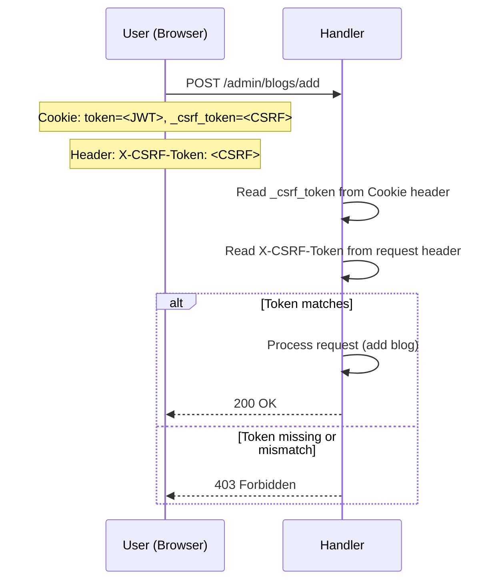
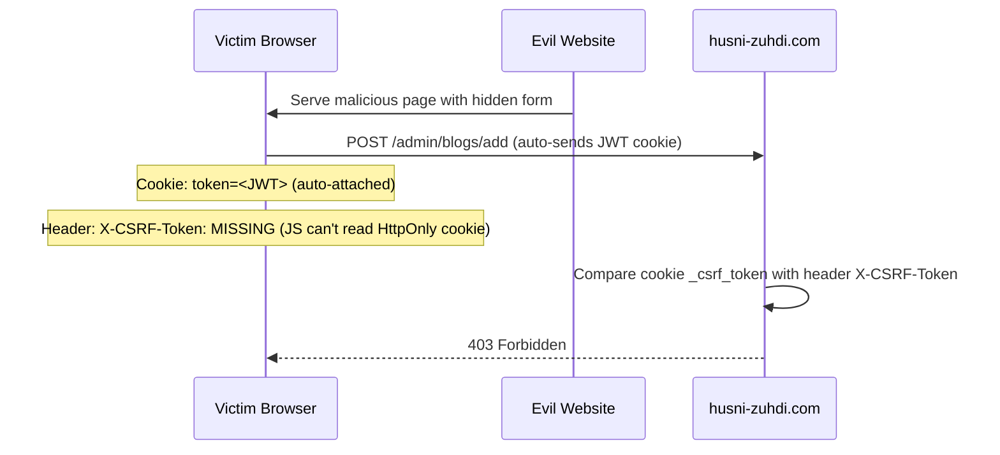

# CSRF Protection

## Goals
Prevent Cross-Site Request Forgery (CSRF) attacks on all state-changing HTMX forms
(login, logout, admin CRUD). An attacker could craft a malicious page that auto-submits
forms to `husni-zuhdi.com` while the admin is logged in. The browser automatically
attaches the JWT cookie, and without CSRF validation, the server cannot distinguish
legitimate from forged requests.

## Criterias
- All state-changing HTMX forms (`hx-post`, `hx-put`, `hx-delete`) include a CSRF token
- The CSRF token is validated server-side on every state-changing request
- The token is tied to the authenticated session (generated at login, cleared at logout)
- The approach uses `hx-headers` for HTMX integration (no additional JS required)
- No heavy session management crate is added (no `axum-sessions`, `tower-sessions`)
- The JWT cookie is upgraded from `SameSite=Lax` to `SameSite=Strict` as a defense-in-depth layer

## Usage
This implementation uses the **Double-Submit Cookie** pattern as recommended by OWASP for
SPA/HTMX backends:

1. On successful login, generate a random CSRF token and set it in a **non-HttpOnly** cookie
   (so HTMX's JavaScript can read it). The JWT cookie remains HttpOnly (inaccessible to JS).
2. HTMX forms include the token via `hx-headers='{"X-CSRF-Token": "<token>"}'`
3. On every state-changing request, the server compares the cookie value with the header value.
   If they don't match, the request is rejected with 403.

This works because:
- An attacker on `evil.com` can cause the browser to **send** the cookie (same-site), but
  **cannot read** the cookie value (Same-Origin Policy), so they cannot set the `X-CSRF-Token`
  header to match.
- The `SameSite=Strict` JWT cookie prevents cross-site cookie submission entirely, adding
  a second layer of defense.

### Token properties
- 32-byte cryptographically random hex string (64 hex characters)
- Generated once per login session (stored as a field in the JWT Claims or a separate cookie)
- Cleared on logout (cookie expired)

### Draft of envars
No new environment variables are required. The CSRF token cookie uses a fixed name
(`_csrf_token`) and is set with `Secure; SameSite=Strict; Path=/`. Unlike the JWT
cookie, it is **not** `HttpOnly` (so JavaScript can read it for the HTMX header).

## Flow

### Login — token generation

```mermaid
sequenceDiagram
    participant U as User (Browser)
    participant H as Handler
    participant JWT as JWT Claims

    U->>H: POST /login (email + password)
    H->>H: Validate credentials
    H->>JWT: Create JWT (exp: 3h)
    H->>H: Generate 32-byte random CSRF token
    H-->>U: Set-Cookie: token=<JWT>; HttpOnly; Secure; SameSite=Strict
    H-->>U: Set-Cookie: _csrf_token=<CSRF>; Secure; SameSite=Strict
    H-->>U: HX-Redirect: /admin
```

### Form submission — token validation



### CSRF attack — blocked



### Logout — token cleared

```mermaid
sequenceDiagram
    participant U as User (Browser)
    participant H as Handler

    U->>H: DELETE /logout
    H-->>U: Set-Cookie: token=; Max-Age=0
    H-->>U: Set-Cookie: _csrf_token=; Max-Age=0
    H-->>U: HX-Redirect: /
```

## Implementation locations

| File | Change |
|---|---|---|
| `src/handler/auth/csrf.rs` | New module: `generate_csrf_token()` (32 random bytes via `ring`), `csrf_set_cookie_header()`, `csrf_clear_cookie_header()`, `verify_csrf_token()` |
| `src/handler/auth/operations.rs` | `post_login`: calls `generate_csrf_token()` + `csrf_set_cookie_header()`. `delete_logout`: calls `csrf_clear_cookie_header()` |
| `src/handler/admin/*/operations.rs` | Call `verify_csrf_token(&headers)` at the top of every POST/PUT/DELETE handler |
| `templates/admin/admin_base.html` | Add `htmx:configRequest` handler that reads `_csrf_token` cookie and sets `X-CSRF-Token` header |
| `Cargo.toml` | Add `ring = "0.17.14"` dependency (for cryptographically secure random token generation) |

### HTMX hx-headers integration
In `templates/admin/admin_base.html`, add a small script that reads the `_csrf_token`
cookie and configures HTMX to include it in all requests:

```html
<script>
    document.addEventListener('htmx:configRequest', function(evt) {
        const csrfToken = document.cookie
            .split('; ')
            .find(row => row.startsWith('_csrf_token='))
            ?.split('=')[1];
        if (csrfToken) {
            evt.detail.headers['X-CSRF-Token'] = csrfToken;
        }
    });
</script>
```

This single script in the admin base template covers all child forms — no need to add
`hx-headers` individually to each form element.

### CSRF token in login form
The login form (`POST /login`) does not need CSRF protection because the user is not
yet authenticated — there is no session to forge. CSRF protection applies only to
authenticated state-changing requests.

## Testing
Unit tests live in `src/handler/auth/csrf.rs` under `#[cfg(test)] mod test`:
- `test_generate_csrf_token_length` — output is 64 hex chars
- `test_generate_csrf_token_unique` — two calls produce different tokens
- `test_generate_csrf_token_hex_only` — output contains only `[0-9a-f]`
- `test_csrf_set_cookie_header_format` — correct Set-Cookie format
- `test_csrf_clear_cookie_header_format` — correct clear-Cookie format
- `test_extract_csrf_from_cookies_found` — extracts token from cookie
- `test_extract_csrf_from_cookies_missing` — returns `None` when absent
- `test_extract_csrf_from_cookies_empty` — returns `None` on empty string
- `test_extract_csrf_from_cookies_first_position` — works when CSRF is the only cookie
- `test_verify_csrf_token_match` — returns `true` when cookie == header
- `test_verify_csrf_token_mismatch` — returns `false` when they differ
- `test_verify_csrf_token_missing_cookie` — returns `false` with no cookie
- `test_verify_csrf_token_missing_header` — returns `false` with no header
- `test_verify_csrf_token_multiple_cookies` — works among other cookies

## References
- [OWASP CSRF Prevention Cheat Sheet](https://cheatsheetseries.owasp.org/cheatsheets/Cross-Site_Request_Forgery_Prevention_Cheat_Sheet.html)
- [OWASP Double-Submit Cookie Pattern](https://cheatsheetseries.owasp.org/cheatsheets/Cross-Site_Request_Forgery_Prevention_Cheat_Sheet.html#double-submit-cookie-pattern)
- [HTMX hx-headers attribute](https://htmx.org/attributes/hx-headers/)
- [HTMX htmx:configRequest event](https://htmx.org/events/#htmx:configRequest)
- [SameSite cookie attribute](https://developer.mozilla.org/en-US/docs/Web/HTTP/Reference/Headers/Set-Cookie#samesite-value)
