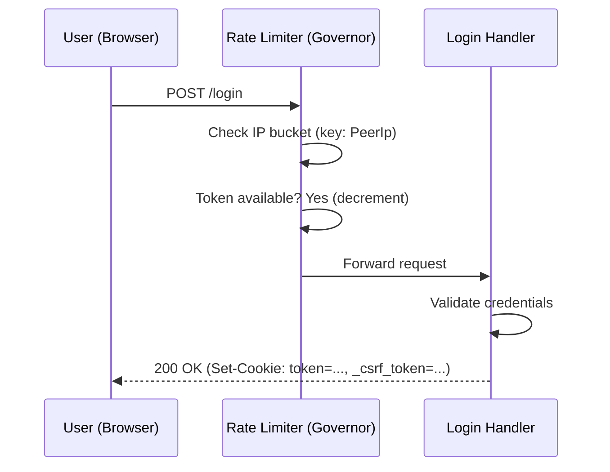
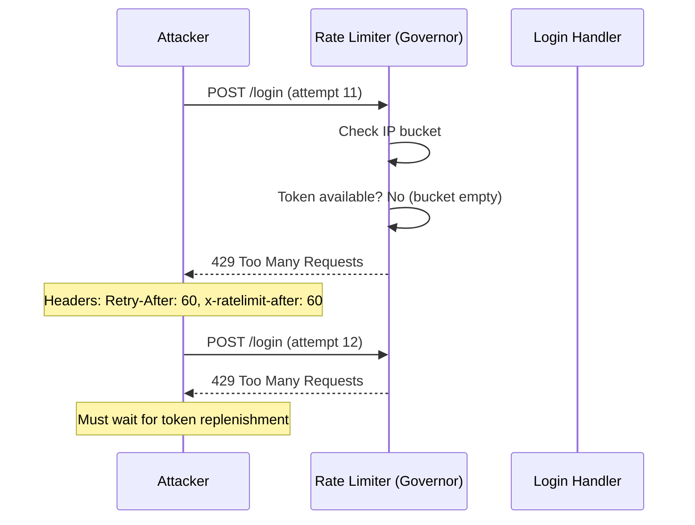
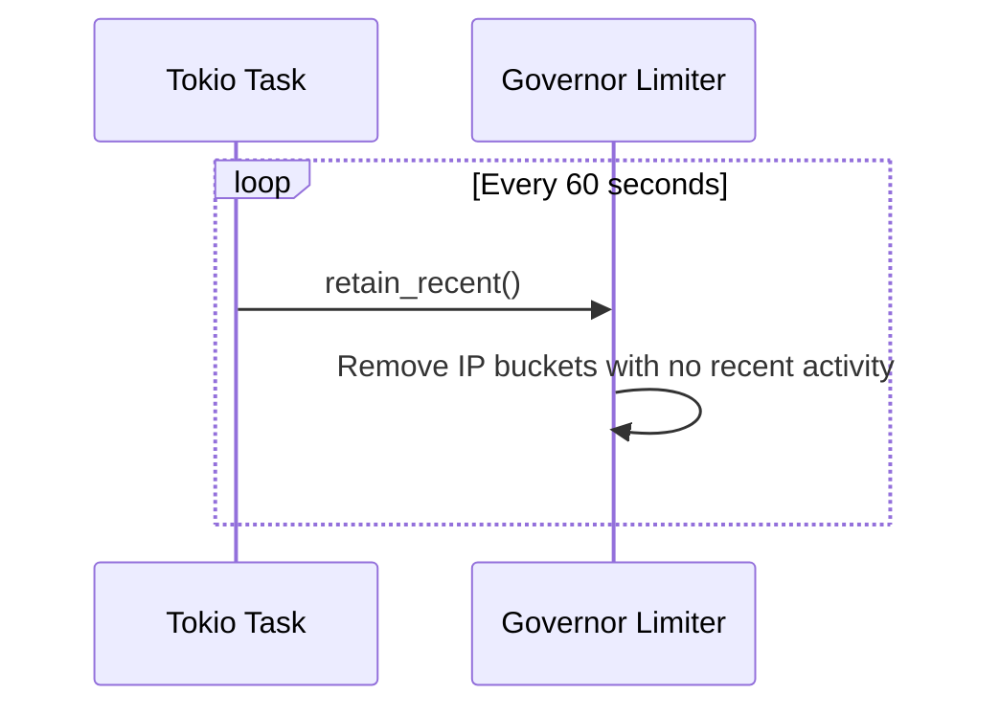

# Rate Limiting

## Goals
Prevent brute-force attacks on the login endpoint (`POST /login`) by limiting the number
of login attempts per IP address within a given time window. The current implementation
has no throttling, allowing unlimited login attempts at network speed.

## Criterias
- Rate limiting is applied **only** to `POST /login` (not to all routes)
- The rate limit configuration is configurable via environment variables
- Rate-limited requests receive a `429 Too Many Requests` response with `Retry-After` header
- Rate limit headers (`x-ratelimit-limit`, `x-ratelimit-remaining`, `x-ratelimit-after`)
  are included in responses
- The rate limiter uses the client's IP address as the key (with proxy-aware header
  extraction for Cloud Run deployment)
- Idle IP buckets are periodically cleaned up to prevent unbounded memory growth
- The `axumserve` startup uses `into_make_service_with_connect_info::<SocketAddr>()`
  to provide peer IP to the rate limiter

## Usage
[tower-governor](https://github.com/benwis/tower-governor) is a Tower middleware that
wraps the [governor](https://github.com/antifuchs/governor) rate-limiting crate. It uses
the Generic Cell Rate Algorithm (GCRA) — a smooth, allocation-free token bucket
implementation. Unlike fixed-window rate limiters, GCRA has no boundary burst issues.

Add `tower-governor` to `Cargo.toml`:
```toml
[dependencies]
tower-governor = { version = "0.8", features = ["axum"] }
```

### Key extractor
The current implementation uses the default `PeerIpKeyExtractor`, which extracts the
peer's socket address directly. **This is incorrect behind Cloud Run** (and similar
reverse proxies) where the peer IP is always the load balancer. A future improvement
should switch to `SmartIpKeyExtractor`, which checks `X-Forwarded-For`, `X-Real-IP`,
and `Forwarded` headers in order before falling back to the peer IP.

### Configuration via environment variables
Follow the existing pattern (like `CACHE_TYPE`, `CACHE_TTL`):

Draft of envars:
- `RATE_LIMIT_BURST_SIZE`
    - Number (u32)
    - Maximum number of requests allowed in a burst before throttling begins
    - Default: `10`
- `RATE_LIMIT_REPLENISH_PERIOD_SECOND`
    - Number (u64)
    - Interval in seconds after which one token is replenished in the bucket
    - Default: `60` (one attempt per minute after burst is exhausted)

### Preset: GovernorConfig::secure()
The `tower-governor` crate provides a `GovernorConfig::secure()` preset: burst of 2,
replenish 1 per 4 seconds. This is designed specifically for login endpoints. Our
configurable env vars allow tuning beyond this preset.

## Flow

### Normal login (within rate limit)



### Rate-limited login (burst exhausted)



### Bucket cleanup



## Implementation locations

| File | Change |
|---|---|---|
| `Cargo.toml` | Add `tower-governor = { version = "0.8", features = ["axum"] }` |
| `src/config.rs` | Add `rate_limit_burst_size: u32` and `rate_limit_replenish_period: u64` fields to `Config`, read from env vars with defaults |
| `src/routes.rs` | Create `GovernorConfig` (default `PeerIpKeyExtractor`), isolate `POST /login` into sub-router with `GovernorLayer`, spawn background cleanup task |
| `src/main.rs` | Switch to `axum::serve(listener, app.into_make_service_with_connect_info::<SocketAddr>())` |

### Route-level layer attachment
The rate limiter is scoped to `POST /login` only. This is done by isolating the POST
handler into a sub-router and merging it after the main route table. The GET login
route stays outside the rate-limited sub-router to avoid blocking the login page itself:

```rust
// In routes.rs
let login_rate_limited = Router::new()
    .route("/login", post(ao::post_login))
    .layer(GovernorLayer::new(governor_conf));

Router::new()
    .route("/login", get(ad::get_login))  // GET is not rate-limited
    .merge(login_rate_limited)             // POST is rate-limited
```

### GovernorConfig construction
```rust
use std::sync::Arc;
use tower_governor::governor::GovernorConfigBuilder;
use tower_governor::GovernorLayer;

let governor_conf = Arc::new(
    GovernorConfigBuilder::default()
        .per_second(app_state.config.rate_limit_replenish_period)
        .burst_size(app_state.config.rate_limit_burst_size)
        .use_headers()
        .finish()
        .unwrap(),
);
```

### Startup change
The server must use `.into_make_service_with_connect_info::<SocketAddr>()` so the rate
limiter's key extractor can access the peer's IP address:

```rust
// main.rs
axum::serve(
    listener,
    app.into_make_service_with_connect_info::<std::net::SocketAddr>(),
)
.await
.unwrap();
```

## Testing
Config parsing tests live in `src/config.rs` under `#[cfg(test)] mod test`:
- `test_default` — asserts `rate_limit_burst_size = 10`, `rate_limit_replenish_period = 60`
- `test_from_envar_without_optionals` — asserts defaults apply when env vars are absent
- `test_from_envar_with_optionals` — asserts custom values are parsed from env vars

## References
- [tower-governor crate](https://github.com/benwis/tower-governor)
- [tower-governor docs.rs](https://docs.rs/tower-governor/latest/tower_governor/)
- [governor crate (rate limiting core)](https://github.com/antifuchs/governor)
- [SmartIpKeyExtractor docs](https://docs.rs/tower-governor/latest/tower_governor/key_extractor/struct.SmartIpKeyExtractor.html)
- [OWASP Brute Force Prevention Cheat Sheet](https://cheatsheetseries.owasp.org/cheatsheets/Brute_Force_Prevention_Cheat_Sheet.html)
- [GCRA algorithm explanation](https://github.com/antifuchs/governor/blob/master/GLOSSARY.md)
