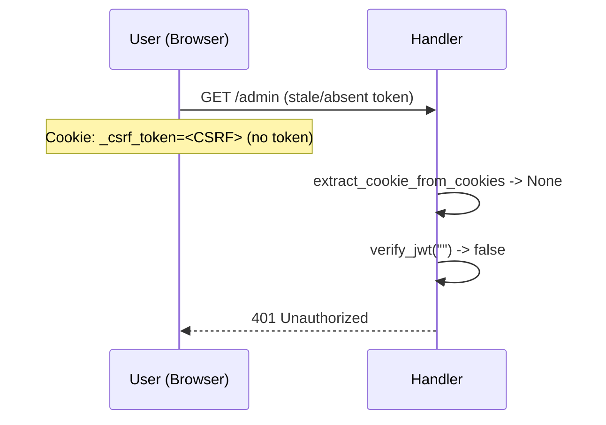

# JWT Authentication

## Goals
Allow the admin to log in with email/password and receive a short-lived JSON Web
Token (JWT) stored in an HttpOnly cookie. Every `/admin` request is authenticated
by verifying that cookie's signature and expiry before serving admin pages or
mutating content.

## Criterias
- Login is password-based (Argon2id hash comparison) and issues a JWT with `iat` and `exp` claims
- The JWT lifetime is 3 hours
- The JWT is stored in an HttpOnly, `Secure`, `SameSite=Strict` cookie named `token`
- A separate non-HttpOnly `_csrf_token` cookie is set at login for CSRF protection
- Every admin handler calls `is_auth_verified()` and returns a 401 on failure
- Cookie parsing matches cookie segments by prefix (`token=` vs `_csrf_token=`) so
  one cookie never swallows the other
- Expired, malformed, empty, or incorrectly-signed tokens fail verification
- Logout clears both the `token` and `_csrf_token` cookies

## Usage
[JSON Web Tokens](https://jwt.io/) are created and verified with the
[jsonwebtoken](https://github.com/Keats/jsonwebtoken) crate, signed with HS256 using
the `JWT_SECRET` config value. The token only carries `iat` and `exp` claims (see
`src/model/auth.rs`).

### Cookie layout
Two cookies are set on a successful login:

| Cookie | Attributes | Purpose |
|---|---|---|
| `token` | `HttpOnly; Secure; SameSite=Strict` | The JWT. HttpOnly keeps it out of JavaScript |
| `_csrf_token` | `Secure; SameSite=Strict` | 64-hex CSRF token, readable by JS for the `X-CSRF-Token` header |

Both are session cookies (no `Max-Age`) and are cleared together on logout.

### Cookie parsing
Both `is_auth_verified()` (JWT cookie) and `verify_csrf_token()` (CSRF cookie) share
`extract_cookie_from_cookies(header, name)`. The `Cookie` header is split on `"; "`
and each segment is matched with `starts_with(name)` instead of substring search.
This matters because `_csrf_token=` **contains** `token=`: a substring search would
return the CSRF value (plus any trailing cookies) as the JWT, breaking verification.

## Flow

### Login — token issuance

```mermaid
sequenceDiagram
    participant U as User (Browser)
    participant H as Handler
    participant DB as Database

    U->>H: POST /login (email + password)
    H->>DB: find_user_by_email(email)
    DB-->>H: hashed_password
    H->>H: is_password_match(password, hash)
    H->>H: create_jwt(secret) -> token
    H->>H: generate_csrf_token() -> csrf
    H-->>U: Set-Cookie: token=<JWT>; HttpOnly; Secure; SameSite=Strict
    H-->>U: Set-Cookie: _csrf_token=<CSRF>; Secure; SameSite=Strict
    H-->>U: HX-Redirect: /admin
```

### Request — token verification

```mermaid
sequenceDiagram
    participant U as User (Browser)
    participant H as Handler

    U->>H: GET /admin
    Note over U: Cookie: token=<JWT>; _csrf_token=<CSRF>
    H->>H: extract_cookie_from_cookies(Cookie, "token=")
    H->>H: verify_jwt(token, JWT_SECRET)
    alt Token valid and not expired
        H-->>U: 200 OK (admin page)
    else Token missing, expired, or invalid
        H-->>U: 401 Unauthorized
    end
```

### Failed verification



### Logout — cookies cleared

```mermaid
sequenceDiagram
    participant U as User (Browser)
    participant H as Handler

    U->>H: DELETE /logout
    H-->>U: Set-Cookie: token=; Max-Age=0
    H-->>U: Set-Cookie: _csrf_token=; Max-Age=0
    H-->>U: HX-Redirect: /
```

## Implementation locations

| File | Change |
|---|---|
| `src/handler/auth/mod.rs` | `create_jwt()` (HS256, `exp` = now + 3h), `verify_jwt()`, `is_auth_verified()`, shared `extract_cookie_from_cookies()` |
| `src/handler/auth/operations.rs` | `post_login` issues the token + CSRF cookie; `delete_logout` clears both |
| `src/handler/auth/displays.rs` | `get_login` redirects to `/admin` when `is_auth_verified()` passes |
| `src/handler/admin/*/displays.rs` | Every admin page gates on `is_auth_verified()` → 401 |
| `src/model/auth.rs` | `Claims { exp, iat }` struct |

## Testing
Unit tests live in `src/handler/auth/mod.rs` under `#[cfg(test)] mod test`:
- `test_create_jwt_structure` — token has 3 dot-separated segments
- `test_verify_jwt_valid_token` — valid token passes
- `test_verify_jwt_empty_token` — empty string fails
- `test_verify_jwt_garbage_token` — malformed token fails
- `test_verify_jwt_wrong_secret` — mismatched secret fails
- `test_verify_jwt_expired_token` — expired claims fail
- `test_verify_jwt_tampered_token` — modified signature fails
- `test_is_auth_verified_valid_token_first` — `token=<jwt>; _csrf_token=<csrf>` passes (regression for cookie-swallowing)
- `test_is_auth_verified_csrf_first` — reversed cookie order passes
- `test_is_auth_verified_missing_token_cookie` — only `_csrf_token` fails without panicking
- `test_is_auth_verified_no_cookie_header` — no `Cookie` header fails
- `test_is_auth_verified_garbage_token` — malformed token fails
- `test_is_auth_verified_wrong_secret` — mismatched secret fails

## References
- [jsonwebtoken crate](https://github.com/Keats/jsonwebtoken)
- [JSON Web Tokens](https://jwt.io/)
- [OWASP Authentication Cheat Sheet](https://cheatsheetseries.owasp.org/cheatsheets/Authentication_Cheat_Sheet.html)
- [RFC 6265 HTTP State Management (cookies)](https://datatracker.ietf.org/doc/html/rfc6265)
- [HTTP Cookie header (MDN)](https://developer.mozilla.org/en-US/docs/Web/HTTP/Reference/Headers/Cookie)
