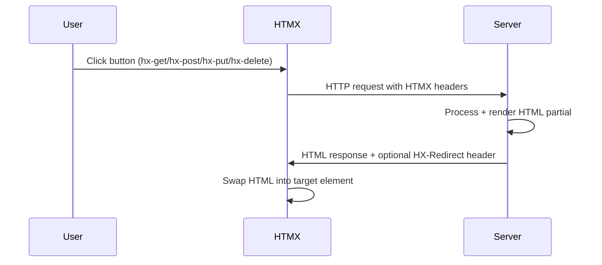
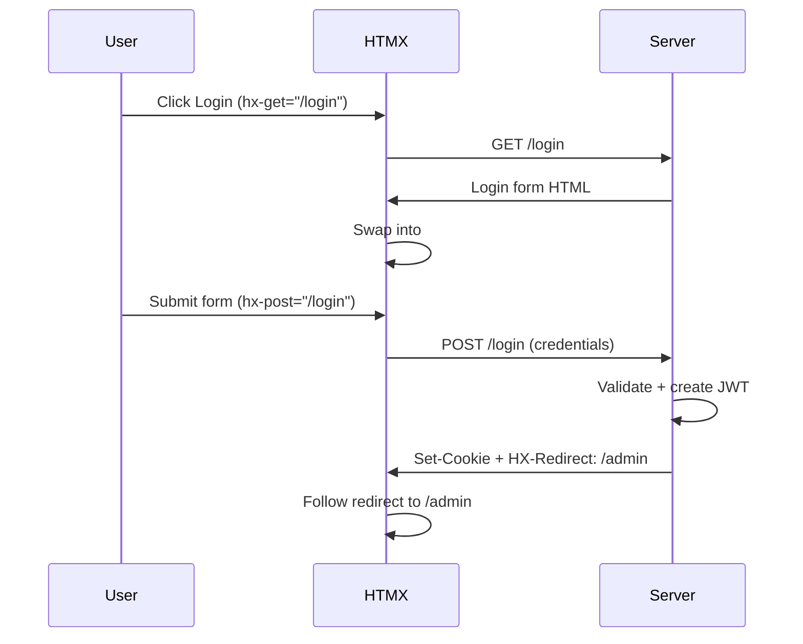
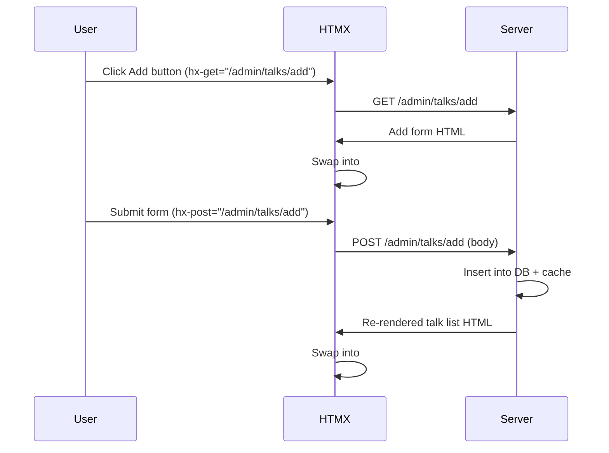

# API & Routes

**Version:** 0.3.5  
**Source:** `src/routes.rs`, `src/handler/*.rs`, `src/handler/admin/**/*.rs`

---

## Goal

Document all HTTP endpoints, their request parameters, response formats, and HTMX interaction patterns.

---

## Route Tree

```
/                          GET   profile::get_profile
/version                   GET   version::get_version
/login                     GET   auth::displays::get_login
/login                     POST  auth::operations::post_login
/logout                    DELETE auth::operations::delete_logout
/etc/passwd                GET   status::get_418_i_am_a_teapot

/blogs                     GET   blogs::get_blogs
/blogs/{blog_id}           GET   blogs::get_blog

/talks                     GET   talks::get_talks

/admin                     GET   admin::displays::get_base_admin
/admin/talks               GET   admin::talks::displays::get_base_admin_talks
/admin/talks/list          GET   admin::talks::displays::get_admin_talks_list
/admin/talks/add           GET   admin::talks::displays::get_add_admin_talk
/admin/talks/add           POST  admin::talks::operations::post_add_admin_talk
/admin/talks/{talk_id}             GET   admin::talks::displays::get_admin_talk
/admin/talks/{talk_id}/edit        GET   admin::talks::displays::get_edit_admin_talk
/admin/talks/{talk_id}/edit        PUT   admin::talks::operations::put_edit_admin_talk
/admin/talks/{talk_id}/delete      GET   admin::talks::displays::get_delete_admin_talk
/admin/talks/{talk_id}/delete      DELETE admin::talks::operations::delete_delete_admin_talk

/admin/blogs               GET   admin::blogs::displays::get_base_admin_blogs
/admin/blogs/list          GET   admin::blogs::displays::get_admin_blogs_list
/admin/blogs/add           GET   admin::blogs::displays::get_add_admin_blog
/admin/blogs/add           POST  admin::blogs::operations::post_add_admin_blog
/admin/blogs/{blog_id}             GET   admin::blogs::displays::get_admin_blog
/admin/blogs/{blog_id}/edit        GET   admin::blogs::displays::get_edit_admin_blog
/admin/blogs/{blog_id}/edit        PUT   admin::blogs::operations::put_edit_admin_blog
/admin/blogs/{blog_id}/delete      GET   admin::blogs::displays::get_delete_admin_blog
/admin/blogs/{blog_id}/delete      DELETE admin::blogs::operations::delete_delete_admin_blog

/admin/blogs/tags               GET   admin::blogs::tags::displays::get_base_admin_tags
/admin/blogs/tags/list          GET   admin::blogs::tags::displays::get_admin_tags_list
/admin/blogs/tags/search        GET   admin::blogs::tags::displays::get_admin_tags_search
/admin/blogs/tags/add           GET   admin::blogs::tags::displays::get_add_admin_tag
/admin/blogs/tags/add           POST  admin::blogs::tags::operations::post_add_admin_tag
/admin/blogs/tags/{tag_id}             GET   admin::blogs::tags::displays::get_admin_tag
/admin/blogs/tags/{tag_id}/edit        GET   admin::blogs::tags::displays::get_edit_admin_tag
/admin/blogs/tags/{tag_id}/edit        PUT   admin::blogs::tags::operations::put_edit_admin_tag
/admin/blogs/tags/{tag_id}/delete      GET   admin::blogs::tags::displays::get_delete_admin_tag
/admin/blogs/tags/{tag_id}/delete      DELETE admin::blogs::tags::operations::delete_delete_admin_tag

/statics/*                 Static file serving (favicon)
/theme.js                  Static file serving (dark mode script)
/styles.css                Static file serving (compiled TailwindCSS)
(fallback)                 GET   status::get_404_not_found
```

---

## Middleware

Applied globally via `src/routes.rs:44`:

- **CompressionLayer** (`tower_http`): Gzip compression on all responses.

---

## Public Endpoints

### GET `/`

Serves the profile/portfolio page.

| Property | Value |
|----------|-------|
| Handler | `profile::get_profile` |
| Auth | No |
| Query params | None |
| Response | `Html<String>` (ProfileTemplate) |

### GET `/version`

Serves build version information.

| Property | Value |
|----------|-------|
| Handler | `version::get_version` |
| Auth | No |
| Query params | None |
| Response | `Html<String>` (VersionTemplate) |
| Dependencies | Reads `version.json` at runtime |

### GET `/blogs`

Lists blogs with optional tag filtering.

| Property | Value |
|----------|-------|
| Handler | `blogs::get_blogs` |
| Auth | No |
| Response | `Html<String>` (BlogsTemplate) |

**Query Parameters:**

| Param | Type | Default | Description |
|-------|------|---------|-------------|
| `start` | i64 | 0 | Pagination offset |
| `end` | i64 | 100 | Pagination limit |
| `tags` | String | "" | Comma-separated tag filter |

**Flow:**
1. Sanitise params.
2. Check cache (if enabled). If hit, render and return.
3. Query database.
4. Populate cache (if enabled) for each result.
5. Render `BlogsTemplate` and return.

### GET `/blogs/{blog_id}`

Renders a single blog post with full markdown body.

| Property | Value |
|----------|-------|
| Handler | `blogs::get_blog` |
| Auth | No |
| Path params | `blog_id: String` (parsed to `i64`) |
| Response | `Html<String>` (BlogTemplate) |

**Flow:**
1. Parse `blog_id` to `i64`. If invalid, return 404.
2. Check cache (if enabled). If hit, render and return.
3. Query database. If not found, return 404.
4. Populate cache (if enabled).
5. Render with `askama::Template::render()` (includes markdown-to-HTML conversion).

### GET `/talks`

Lists talks.

| Property | Value |
|----------|-------|
| Handler | `talks::get_talks` |
| Auth | No |
| Response | `Html<String>` (TalksTemplate) |

**Query Parameters:**

| Param | Type | Default | Description |
|-------|------|---------|-------------|
| `start` | i64 | 0 | Pagination offset |
| `end` | i64 | 100 | Pagination limit |

**Flow:** Same cache-then-DB pattern as `/blogs`.

---

## Auth Endpoints

### GET `/login`

Serves the login form.

| Property | Value |
|----------|-------|
| Handler | `auth::displays::get_login` |
| Auth | Checks existing JWT (auto-redirects if valid) |
| Response | `(HeaderMap, Html<String>)` (LoginTemplate) |

**Behavior:**
- If valid JWT cookie exists, sets `HX-Redirect: /admin` header.
- Renders login form that POSTs via HTMX.

### POST `/login`

Handles login form submission.

| Property | Value |
|----------|-------|
| Handler | `auth::operations::post_login` |
| Auth | No (validates credentials) |
| Content-Type | `application/x-www-form-urlencoded` |
| Response | `impl IntoResponse` (LoginSuccessTemplate + headers) |

**Request Body:**

| Field | Type | Description |
|-------|------|-------------|
| `login_email` | String | User email |
| `login_password` | String | User password |

**Flow:**
1. Parse URL-encoded body.
2. Sanitise email (regex `^.*@.*\..*$`), remove whitespace from password.
3. Look up user by email. If not found, render login retry.
4. Verify password against Argon2 hash. If mismatch, render login retry.
5. Create JWT (3-hour expiry).
6. Set `Set-Cookie: token={jwt}; Secure; HttpOnly; SameSite=Lax`.
7. Set `HX-Redirect: /admin`.
8. Render `LoginSuccessTemplate`.

### DELETE `/logout`

Clears the JWT cookie.

| Property | Value |
|----------|-------|
| Handler | `auth::operations::delete_logout` |
| Auth | Yes (verifies JWT) |
| Response | `(HeaderMap, Html<String>)` (LogoutTemplate) |

**Flow:**
1. Verify JWT. If invalid, return 401.
2. Set `Set-Cookie: token=; ...` (empty value to clear).
3. Set `HX-Redirect: /`.
4. Render `LogoutTemplate`.

---

## Status Endpoints

| Endpoint | Handler | Response |
|----------|---------|----------|
| `GET /etc/passwd` | `status::get_418_i_am_a_teapot` | 418 Teapot page |
| (fallback) | `status::get_404_not_found` | 404 page |

---

## Admin Endpoints

All admin endpoints require valid JWT cookie. Returns 401 page if unauthenticated.

### Admin Dashboard

#### GET `/admin`

| Property | Value |
|----------|-------|
| Handler | `admin::displays::get_base_admin` |
| Auth | Yes |
| Response | `Html<String>` (AdminTemplate) |

---

### Admin Talks

#### GET `/admin/talks`

| Property | Value |
|----------|-------|
| Handler | `admin::talks::displays::get_base_admin_talks` |
| Auth | Yes |
| Response | `Html<String>` (AdminTalksTemplate) |

#### GET `/admin/talks/list`

| Property | Value |
|----------|-------|
| Handler | `admin::talks::displays::get_admin_talks_list` |
| Auth | Yes |
| Response | `Html<String>` (AdminListTalksTemplate) |
| HTMX target | `#talks_target` |

**Query Parameters:** `start`, `end` (same as public `/talks`).

#### GET `/admin/talks/add`

| Property | Value |
|----------|-------|
| Handler | `admin::talks::displays::get_add_admin_talk` |
| Auth | Yes |
| Response | `Html<String>` (AdminGetAddTalkTemplate) |
| HTMX target | `#talks_target` |

Pre-fills date with `chrono::Local::now()` formatted as `%Y-%m-%d`.

#### POST `/admin/talks/add`

| Property | Value |
|----------|-------|
| Handler | `admin::talks::operations::post_add_admin_talk` |
| Auth | Yes |
| Content-Type | `application/x-www-form-urlencoded` |

**Request Body:**

| Field | Type | Description |
|-------|------|-------------|
| `talk_id` | i64 | Auto-generated ID |
| `talk_name` | String | Talk title |
| `talk_date` | String | Date (YYYY-MM-DD) |
| `talk_media_link` | String (optional) | Recording URL |
| `talk_org_name` | String (optional) | Organisation name |
| `talk_org_link` | String (optional) | Organisation URL |

**Response:** Re-renders `/admin/talks/list` (full talk list).

#### GET `/admin/talks/{talk_id}`

Returns single talk detail view. Used for in-place refresh after edit.

#### GET `/admin/talks/{talk_id}/edit`

Returns edit form pre-filled with talk data.

#### PUT `/admin/talks/{talk_id}/edit`

| Property | Value |
|----------|-------|
| Handler | `admin::talks::operations::put_edit_admin_talk` |
| Auth | Yes |
| Content-Type | `application/x-www-form-urlencoded` |

**Response:** Re-renders `/admin/talks/{talk_id}` (single talk view).

**Cache behavior:** Invalidate old entry, insert updated entry.

#### GET `/admin/talks/{talk_id}/delete`

Returns delete confirmation page.

#### DELETE `/admin/talks/{talk_id}/delete`

| Property | Value |
|----------|-------|
| Handler | `admin::talks::operations::delete_delete_admin_talk` |
| Auth | Yes |

**Response:** Re-renders `/admin/talks/list` (full talk list).

**Cache behavior:** Invalidate entry only.

---

### Admin Blogs

Follows the same pattern as Admin Talks with these differences:

- CRUD endpoints at `/admin/blogs/...`
- Blog add/edit forms support **multi-select tags** (HTML `<select multiple>`)
- Blog body is markdown (textarea, 10 rows x 60 cols)
- Blog add/edit body is processed by `process_blog_body` which supports multiple `blog_tag` form fields
- Cache invalidation for edits does invalidate + re-insert (2 ops)
- Blog delete also cleans up `blog_tag_mapping` entries

#### POST `/admin/blogs/add` — Additional Fields

| Field | Type | Description |
|-------|------|-------------|
| `blog_id` | i64 | Auto-generated ID |
| `blog_name` | String | Blog title |
| `blog_body` | String | Markdown content |
| `blog_tag` | String (multi) | Tag names (can appear multiple times) |

**Flow after insert:** Also creates `blog_tag_mapping` entries for each selected tag.

#### PUT `/admin/blogs/{blog_id}/edit` — Tag Sync

When editing a blog, the handler computes a diff between current and requested tags:
1. Delete mappings for tags no longer selected.
2. Add mappings for newly selected tags.

---

### Admin Blog Tags

Same CRUD pattern. Unique feature: **search** endpoint.

#### GET `/admin/blogs/tags/search`

| Property | Value |
|----------|-------|
| Handler | `admin::blogs::tags::displays::get_admin_tags_search` |
| HTMX trigger | `input changed delay:500ms` (debounced) |

**Query Parameters:**

| Param | Type | Description |
|-------|------|-------------|
| `start` | i64 | Pagination start |
| `end` | i64 | Pagination end |
| `query` | String | Search term |

Search uses SQL `LIKE '%query%'` on tag name.

> **Known issue:** `delete_delete_admin_tag` at `src/handler/admin/blogs/tags/operations.rs` expects `TagCommandStatus::Updated` instead of `Deleted`.

---

## HTMX Patterns

The frontend uses HTMX 2.0.6 for partial page updates without full reloads.

### Standard Flow



### HTMX Headers Used

| Header | Direction | Purpose |
|--------|-----------|---------|
| `HX-Redirect` | Response | Redirect client to URL (e.g., `/admin` after login) |
| `HX-Request` | Request | Identifies HTMX requests |

### Common HTMX Attributes

| Attribute | Usage |
|-----------|-------|
| `hx-get` | Load content on click or trigger |
| `hx-post` | Submit form via POST |
| `hx-put` | Submit form via PUT |
| `hx-delete` | Submit form via DELETE |
| `hx-target` | CSS selector for response swap target |
| `hx-swap` | Swap strategy (default: `innerHTML`) |
| `hx-trigger` | Event trigger (e.g., `input changed delay:500ms`) |

### Auth Flow with HTMX



### Admin CRUD Flow with HTMX


