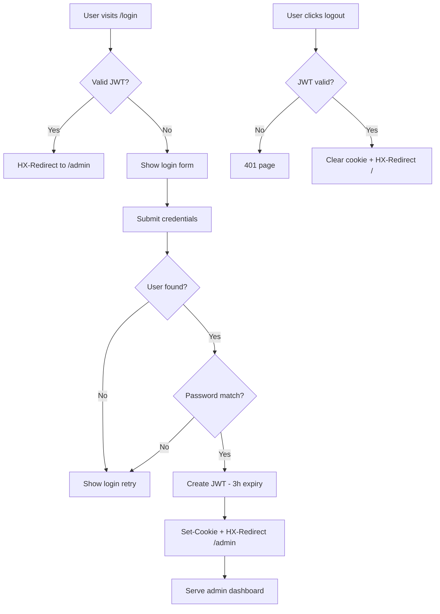

# Authentication & Authorization

**Version:** 0.3.5  
**Source:** `src/handler/auth/*.rs`, `src/usecase/auth.rs`, `src/repo/auth.rs`, `src/model/auth.rs`

---

## Goal

Protect admin endpoints with JWT cookie-based authentication. Verify passwords using Argon2 hashing.

---

## Architecture

```
Browser                    Server
  |                          |
  |-- POST /login ---------->|  parse body → find_user_by_email
  |                          |  → is_password_match (Argon2)
  |                          |  → create_jwt (3h expiry)
  |<-- Set-Cookie: token=...--|
  |<-- HX-Redirect: /admin --|

  |-- GET /admin ----------->|  is_auth_verified (extract + decode JWT)
  |                          |  → valid? serve page : 401
  |<-- HTML or 401 ----------|

  |-- DELETE /logout ------->|  is_auth_verified
  |<-- Set-Cookie: token= ---|  clear cookie
  |<-- HX-Redirect: / ------|
```

---

## Authentication Flow

### Login

1. User submits form via HTMX: `POST /login`
2. Server parses URL-encoded body: `login_email` + `login_password`
3. Sanitise email (regex: `^.*@.*\..*$`), strip whitespace from password
4. Look up user by email: `auth_uc.find_user_by_email(email)`
5. If user not found → render `LoginRetryTemplate`
6. Verify password: `is_password_match(password, hashed_password)` using Argon2
7. If mismatch → render `LoginRetryTemplate`
8. Create JWT with claims `{ exp: now + 10800, iat: now }`
9. Set response headers:
   - `Set-Cookie: token={jwt}; Secure; HttpOnly; SameSite=Lax`
   - `HX-Redirect: /admin`
10. Render `LoginSuccessTemplate`

### Logout

1. User clicks logout: `DELETE /logout`
2. Server verifies JWT via `is_auth_verified()`
3. If invalid → return 401 page
4. Clear cookie: `Set-Cookie: token=; Secure; HttpOnly; SameSite=Lax`
5. Redirect: `HX-Redirect: /`
6. Render `LogoutTemplate`

---

## JWT Implementation

**Source:** `src/handler/auth/mod.rs:125-165`

| Property | Value |
|----------|-------|
| Library | `jsonwebtoken` v10.0.0 |
| Algorithm | Default (HS256) |
| Secret | Configurable via `JWT_SECRET` env var |
| Expiry | 3 hours (10800 seconds) |
| Claims | `{ exp: usize, iat: usize }` |
| Cookie | `Secure`, `HttpOnly`, `SameSite=Lax` |

### Token Creation

```
fn create_jwt(secret: &str) -> Option<String>
  → Header::default() + Claims { exp: now + 10800, iat: now }
  → jwt_encode(Header, Claims, EncodingKey::from_secret(secret))
```

### Token Verification

```
pub fn verify_jwt(token: &str, secret: &str) -> bool
  → jwt_decode::<Claims>(token, DecodingKey::from_secret(secret), Validation::default())
  → Ok(_) => true, Err(_) => false
```

### Auth Check in Handlers

```
pub fn is_auth_verified(header: HeaderMap, jwt_secret: &str) -> bool
  → Extract token from Cookie header (key: "token=")
  → verify_jwt(token, secret)
```

---

## Password Hashing

**Source:** `src/handler/auth/mod.rs:106-121`

| Property | Value |
|----------|-------|
| Library | `argon2` v0.6.0-rc.8, `password-hash` v0.6.0 |
| Algorithm | Argon2 (default params) |
| Storage | `hashed_password` field in `users` table |
| Verification | `PasswordHash::new(hashed_password)` + `Argon2::default().verify_password()` |

---

## Database Schema

### users

```sql
CREATE TABLE IF NOT EXISTS users (
    id TEXT NOT NULL,
    email TEXT NOT NULL,
    hashed_password TEXT NOT NULL
);
```

### sessions

```sql
CREATE TABLE IF NOT EXISTS sessions (
    id TEXT NOT NULL,
    user_id TEXT NOT NULL,
    token TEXT NOT NULL,
    expire TEXT NOT NULL
);
```

> **Note:** The `sessions` table exists in the schema but is not actively used in the current implementation. JWT tokens are stateless and verified purely by decoding.

---

## Repo Interface

**Source:** `src/repo/auth.rs`

```rust
#[async_trait]
pub trait AuthRepo: DynClone {
    async fn find_user_by_id(&self, id: String) -> Option<User>;
    async fn find_user_by_email(&self, email: String) -> Option<User>;
    async fn add_user(&self, id: String, email: String, hpass: String) -> Option<UserCommandStatus>;
    async fn update_user(&self, id: String, email: Option<String>, hpass: Option<String>) -> Option<UserCommandStatus>;
    async fn delete_user(&self, id: String) -> Option<UserCommandStatus>;
    async fn find_session(&self, id: String) -> Option<Session>;
    async fn add_session(&self, id: String, user_id: String, token: String, expire: String) -> Option<SessionCommandStatus>;
    async fn delete_session(&self, id: String) -> Option<SessionCommandStatus>;
}
```

---

## SQL Queries

| Operation | Query | Source |
|-----------|-------|--------|
| Find user by ID | `SELECT id, email, hashed_password FROM users WHERE id=?1 LIMIT 1` | `src/database/turso/auth.rs:10-28` |
| Find user by email | `SELECT id, email, hashed_password FROM users WHERE email=?1 LIMIT 1` | `src/database/turso/auth.rs:30-49` |
| Add user | `INSERT INTO users (id, email, hashed_password) VALUES (?1, ?2, ?3)` | `src/database/turso/auth.rs:51-73` |
| Update user | `UPDATE users SET <col>=<val> WHERE id = ?1` (dynamic) | `src/database/turso/auth.rs:75-110` |
| Delete user | `DELETE FROM users WHERE id = ?1` | `src/database/turso/auth.rs:112-129` |
| Find session | `SELECT id, user_id, token, expire FROM sessions WHERE id=?1 LIMIT 1` | `src/database/turso/auth.rs:131-150` |
| Add session | `INSERT INTO sessions (id, user_id, token, expire) VALUES (?1, ?2, ?3, ?4)` | `src/database/turso/auth.rs:152-177` |
| Delete session | `DELETE FROM sessions WHERE id = ?1` | `src/database/turso/auth.rs:179-199` |

> **Security note:** `update_user` at `src/database/turso/auth.rs:75-110` interpolates values directly into SQL via `format!`. This is a SQL injection risk, though in practice only admin users can trigger it.

---

## Authorization Gating

Every admin handler calls `is_auth_verified()` before processing:

```rust
pub async fn get_base_admin_blogs(
    State(app_state): State<AppState>,
    headers: HeaderMap,
) -> Html<String> {
    if !is_auth_verified(headers, &app_state.config.secrets.jwt_secret) {
        return get_401_unauthorized().await;
    }
    // ... serve page
}
```

**Gated endpoints:**
- All `/admin/*` routes
- `DELETE /logout`

**Ungated endpoints:**
- `/`, `/version`, `/blogs`, `/blogs/{id}`, `/talks`
- `GET /login`, `POST /login`
- `/etc/passwd` (418 teapot)
- `/statics/*`, `/theme.js`, `/styles.css`

---

## Edge Cases & Known Issues

1. **No refresh token**: JWT expires after 3 hours with no refresh mechanism. User must re-login.
2. **Session table unused**: The `sessions` table and related repo methods exist but are not wired into the login flow.
3. **Typo**: Function `get_login_sucess` (missing 'c') at `src/handler/auth/displays.rs:40`.
4. **Weak email regex**: The regex `^.*@.*\..*$` at `src/handler/auth/mod.rs:81` is very permissive.
5. **No rate limiting**: Login endpoint has no brute-force protection.
6. **RC dependency**: `argon2 = "=0.6.0-rc.8"` is pinned to a pre-release version.

---

## Flow Diagram


