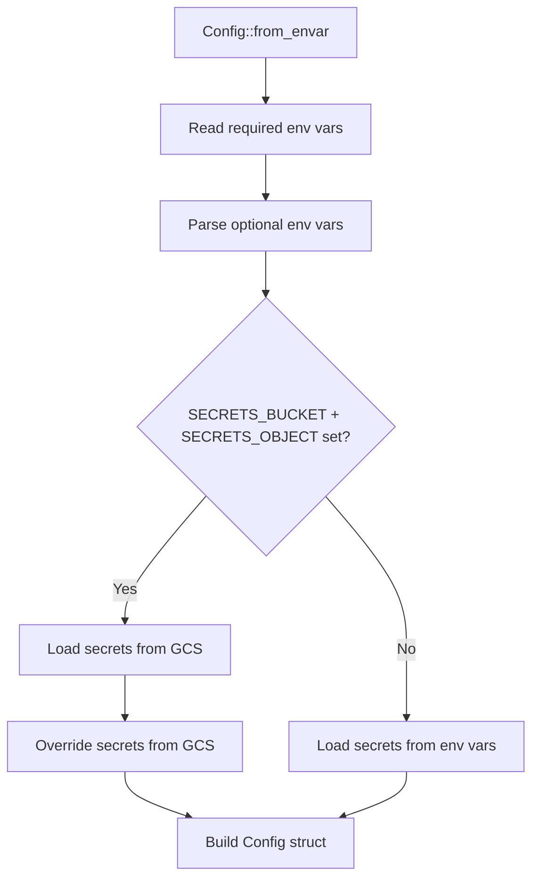

# Configuration & DevOps

**Version:** 0.3.5  
**Source:** `src/config.rs`, `Taskfile.yml`, `deny.toml`, `renovate.json`, `release-plz.toml`, `clippy.toml`, `.github/workflows/*.yml`

---

## Goal

Centralize all configuration, environment variables, and DevOps tooling into a single reference.

---

## Configuration System

**Source:** `src/config.rs`

### Config Struct

| Field | Type | Default | Required | Description |
|-------|------|---------|----------|-------------|
| `svc_endpoint` | `String` | `"localhost"` | Yes | Server bind address |
| `svc_port` | `String` | `"8080"` | Yes | Server port |
| `log_level` | `tracing::Level` | `INFO` | No | Log level (ERROR/WARN/INFO/DEBUG/TRACE) |
| `environment` | `Environment` | `Release` | No | `Development` or `Release` |
| `data_source` | `String` | `"sqlite"` | No | `sqlite` or `turso` |
| `secrets` | `Secrets` | — | Yes | Collection of secrets |
| `secrets_bucket` | `Option<String>` | `None` | No | GCS bucket for secrets |
| `secrets_object` | `Option<String>` | `None` | No | GCS object for secrets |
| `cache_type` | `Option<Cache>` | `None` | No | Cache type (`InMemory` or `None`) |
| `cache_ttl` | `Option<i64>` | `None` | No | Cache TTL in seconds |

### Secrets Struct

| Field | Type | Default | Description |
|-------|------|---------|-------------|
| `jwt_secret` | `String` | `"secret"` | JWT signing key |
| `database_url` | `String` | `"file:local.db"` | SQLite path or Turso URL |
| `turso_auth_token` | `Option<String>` | `None` | Turso auth token |

---

## Environment Variables

### Required

| Variable | Type | Description |
|----------|------|-------------|
| `SVC_ENDPOINT` | String | Server bind address (e.g., `localhost`, `0.0.0.0`) |
| `SVC_PORT` | String | Server port (e.g., `8080`) |

### Optional — Core

| Variable | Type | Default | Description |
|----------|------|---------|-------------|
| `LOG_LEVEL` | String | `INFO` | Tracing log level |
| `ENVIRONMENT` | String | `Release` | Environment type |
| `DATA_SOURCE` | String | `sqlite` | Database backend (`sqlite` or `turso`) |

### Optional — Secrets

| Variable | Type | Default | Description |
|----------|------|---------|-------------|
| `JWT_SECRET` | String | `"secret"` | JWT signing key (override in production!) |
| `DATABASE_URL` | String | `"file:local.db"` | Database connection string |
| `TURSO_AUTH_TOKEN` | String | `None` | Turso auth token (required for `turso` data source) |
| `SECRETS_BUCKET` | String | `None` | GCS bucket name for secrets |
| `SECRETS_OBJECT` | String | `None` | GCS object path for secrets |

### Optional — Cache

| Variable | Type | Default | Description |
|----------|------|---------|-------------|
| `CACHE_TYPE` | String | `None` | Cache type (`inmemory` or `InMemory`) |
| `CACHE_TTL` | i64 | `None` | Cache TTL in seconds (e.g., `3600`) |

---

## Config Loading Flow



**Source:** `src/config.rs:147-210`

### GCS Secret Loading

1. Build GCS client via `Storage::builder().build()`
2. Read object from `projects/_/buckets/{bucket}/{object}`
3. Parse newline-separated `KEY=VALUE` format
4. Recognised keys: `JWT_SECRET`, `DATABASE_URL`, `TURSO_AUTH_TOKEN`

---

## Cargo Deny

**Source:** `deny.toml`

### Advisories

Ignored (pending upstream fixes):
- `RUSTSEC-2023-0071` — jsonwebtoken dependency issue
- `RUSTSEC-2025-0134` — libsql and Google libs dependency issue

### Allowed Licenses

MIT, Apache-2.0, Unicode-3.0, ISC, BSD-3-Clause, CDLA-Permissive-2.0

### Bans

- Multiple versions: warn
- No crates explicitly denied
- Private crate checking: enabled

### Sources

- Unknown registry: warn
- Unknown git: warn
- Only crates.io allowed

---

## Clippy Configuration

**Source:** `clippy.toml`

```toml
cognitive-complexity-threshold = 150
```

Default is 25. Setting to 150 allows very complex functions without triggering the lint.

**Lint level in Taskfile:** `-D clippy::nursery` (deny nursery lints)

---

## Renovate

**Source:** `renovate.json`

### Package Rules

| Rule | Match | Behavior |
|------|-------|----------|
| All non-major Rust deps | Cargo, minor/patch | Group into single PR |
| All GitHub Actions deps | github-actions (except ubuntu) | Group into single PR |
| Dockerfile | dockerfile, docker-compose | Disabled (no auto-updates) |

---

## Release-plz

**Source:** `release-plz.toml`

### Configuration

| Setting | Value | Description |
|---------|-------|-------------|
| `changelog_update` | `false` | No auto-changelog |
| `git_tag_enable` | `true` | Create git tags |
| `git_tag_name` | `{{ version }}` | Tag format (just version number) |
| `release_commits` | `^feat[(:]` | Only `feat` commits trigger release |
| `publish` | `false` | No crates.io publish |

### Commit Parsers

| Pattern | Group |
|---------|-------|
| `^feat` | added |
| `^.*: support` | added |
| `^changed` | changed |
| `^deprecated` | changed |
| `^.*: remove` | deprecated |
| `^.*: delete` | deprecated |
| `^(fix\|test)` | fixed |
| `^.*: fix` | fixed |
| `^security` | security |
| `^.*` | other |

### Preprocessors

Strip issue references: `(\w+\s)?#(\d+)` → removed from commit messages.

---

## CI/CD Pipeline

See [deployment.md](deployment.md) for full CI/CD flow.

### Workflow Summary

| Workflow | Trigger | Jobs |
|----------|---------|------|
| `rust-ci.yml` | Push (non-main), PR open | test, nextest, fmt, clippy, coverage |
| `rust-push-build.yml` | Tag push | Docker build + push to GCR |
| `rust-release.yml` | Push to main | release-plz creates PR |
| `rust-audit.yml` | Weekly + push (non-main) + PR open | cargo-deny security audit |

---

## Dependency Versions

**Source:** `Cargo.toml`

| Crate | Version | Purpose |
|-------|---------|---------|
| axum | 0.8.0 | Web framework |
| tokio | 1.43 | Async runtime |
| askama | 0.15.0 | Template engine |
| markdown | 1.0.0-alpha.17 | Markdown → HTML |
| libsql | 0.9.0 | SQLite/Turso driver |
| moka | 0.12.12 | In-memory cache |
| jsonwebtoken | 10.0.0 | JWT encode/decode |
| argon2 | 0.6.0-rc.8 | Password hashing (pinned RC) |
| password-hash | 0.6.0 | Password hash traits |
| google-cloud-storage | 1.1.0 | GCS client |
| tower-http | 0.6.0 | HTTP middleware (gzip, static files) |
| serde / serde_json | 1.0.192 / 1.0.108 | Serialization |
| regex | 1.10.6 | Pattern matching |
| chrono | 0.4.41 | Date/time |
| tracing | 0.1 | Structured logging |

---

## Build Tool

### Build Script

**Source:** `build.rs`

Uses `vergen-gitcl` to emit build timestamp at compile time.

### Version Manifest

**Source:** `version.json` (generated by `task update-version`)

```json
{
  "version": "<from Cargo.toml>",
  "build_date": "<YYYY-MM-DD>",
  "build_hash": "<git HEAD hash>"
}
```

---

## Known Issues

1. **Pinned RC dependency**: `argon2 = "=0.6.0-rc.8"` prevents automatic updates.
2. **Permissive clippy threshold**: `cognitive-complexity-threshold = 150` masks complex code.
3. **No changelog**: `changelog_update = false` in release-plz.
4. **Ignored advisories**: Two security advisories are suppressed.
5. **Docker auto-update disabled**: Renovate does not update Dockerfile base images.
