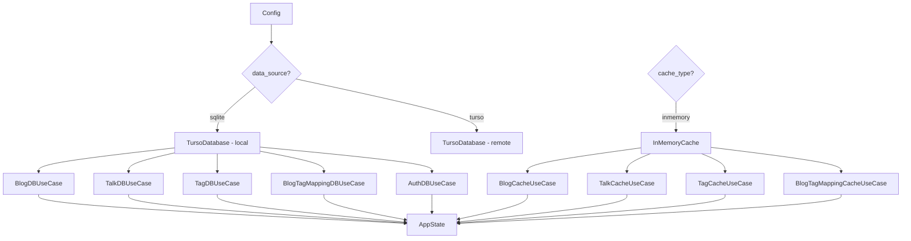
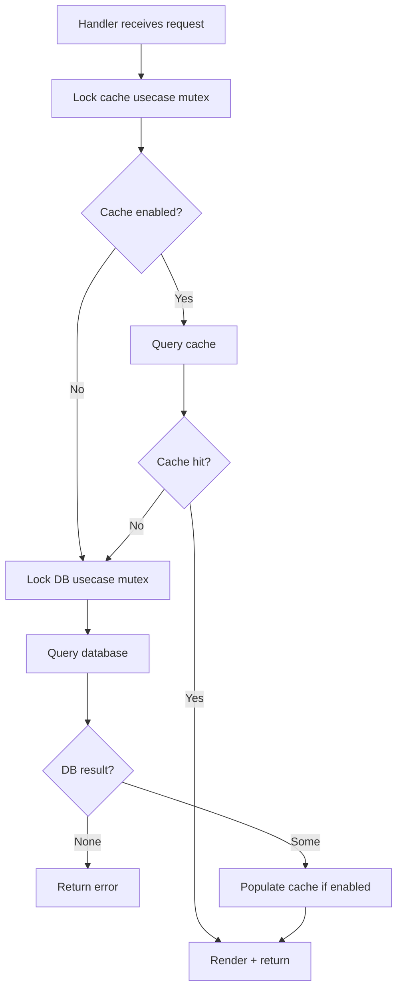

# Database Layer

**Version:** 0.3.5  
**Source:** `src/repo/*.rs`, `src/database/turso/*.rs`, `src/usecase/*.rs`, `src/cache/inmemory/*.rs`

---

## Goal

Define the storage abstraction (repo traits), concrete adapters (Turso/SQLite and in-memory cache), and the usecase layer that orchestrates them.

---

## Architecture

```
Handler
  │
  ▼
Usecase (BlogDBUseCase / BlogCacheUseCase)
  │       delegates to
  ├──▶ Repo Trait (BlogDisplayRepo / BlogOperationRepo)
  │         │
  │         ├──▶ TursoDatabase (SQLite / Turso)
  │         └──▶ InMemoryCache (Moka)
  │
  ▼
Response
```

**Key principle:** Handlers never access repos directly. Usecases own the repos. Usecases implement the same traits as repos, so callers interact uniformly.

---

## Repo Traits

All repo traits use `#[async_trait]` and `DynClone` (for `Box<dyn Trait>` cloning).

### BlogDisplayRepo

**Source:** `src/repo/blogs.rs:10-13`

| Method | Signature | Description |
|--------|-----------|-------------|
| `find` | `async fn find(&self, id: i64) -> Option<Blog>` | Single blog by ID |
| `find_blogs` | `async fn find_blogs(&self, params: BlogsParams) -> Option<Vec<Blog>>` | Paginated list with tag filter |

### BlogOperationRepo

**Source:** `src/repo/blogs.rs:16-22`

| Method | Signature | Description |
|--------|-----------|-------------|
| `check_id` | `async fn check_id(&self, id: i64) -> Option<BlogCommandStatus>` | Verify blog exists |
| `get_new_id` | `async fn get_new_id(&self) -> Option<i64>` | Next available ID |
| `add` | `async fn add(&mut self, blog: Blog) -> Option<BlogCommandStatus>` | Insert blog |
| `update` | `async fn update(&mut self, blog: Blog) -> Option<BlogCommandStatus>` | Update blog |
| `delete` | `async fn delete(&mut self, id: i64) -> Option<BlogCommandStatus>` | Delete blog |

### BlogCacheOperationRepo

**Source:** `src/repo/blogs.rs:25-28`

| Method | Signature | Description |
|--------|-----------|-------------|
| `insert` | `async fn insert(&mut self, blog: Blog) -> Option<BlogCommandStatus>` | Cache blog |
| `invalidate` | `async fn invalidate(&mut self, id: i64) -> Option<BlogCommandStatus>` | Remove from cache |

---

### TalkDisplayRepo

**Source:** `src/repo/talks.rs:9-12`

| Method | Signature |
|--------|-----------|
| `find` | `async fn find(&self, id: i64) -> Option<Talk>` |
| `find_talks` | `async fn find_talks(&self, params: TalksParams) -> Option<Talks>` |

### TalkOperationRepo

**Source:** `src/repo/talks.rs:15-20`

| Method | Signature |
|--------|-----------|
| `get_new_id` | `async fn get_new_id(&self) -> Option<i64>` |
| `add` | `async fn add(&mut self, id, name, date, media_link, org_name, org_link) -> Option<TalkCommandStatus>` |
| `update` | `async fn update(&mut self, id, name?, date?, media_link?, org_name?, org_link?) -> Option<TalkCommandStatus>` |
| `delete` | `async fn delete(&mut self, id: i64) -> Option<TalkCommandStatus>` |

### TalkCacheOperationRepo

**Source:** `src/repo/talks.rs:23-27`

| Method | Signature |
|--------|-----------|
| `insert` | `async fn insert(&mut self, talk: Talk) -> Option<TalkCommandStatus>` |
| `invalidate` | `async fn invalidate(&mut self, id: i64) -> Option<TalkCommandStatus>` |

---

### TagDisplayRepo

**Source:** `src/repo/tags.rs:9-13`

| Method | Signature |
|--------|-----------|
| `find` | `async fn find(&self, id: i64) -> Option<Tag>` |
| `find_tags` | `async fn find_tags(&self, params: TagsListParams) -> Option<Tags>` |
| `search_tags` | `async fn search_tags(&self, params: TagsSearchParams) -> Option<Tags>` |

### TagOperationRepo

**Source:** `src/repo/tags.rs:16-21`

| Method | Signature |
|--------|-----------|
| `get_new_id` | `async fn get_new_id(&self) -> Option<i64>` |
| `add` | `async fn add(&mut self, id: i64, name: String) -> Option<TagCommandStatus>` |
| `update` | `async fn update(&mut self, id: i64, name: Option<String>) -> Option<TagCommandStatus>` |
| `delete` | `async fn delete(&mut self, id: i64) -> Option<TagCommandStatus>` |

### TagCacheOperationRepo

**Source:** `src/repo/tags.rs:24-28`

| Method | Signature |
|--------|-----------|
| `insert` | `async fn insert(&mut self, tag: Tag) -> Option<TagCommandStatus>` |
| `invalidate` | `async fn invalidate(&mut self, id: i64) -> Option<TagCommandStatus>` |

---

### BlogTagMappingDisplayRepo

**Source:** `src/repo/blog_tag_mappings.rs:9-12`

| Method | Signature |
|--------|-----------|
| `find_by_blog_id` | `async fn find_by_blog_id(&self, blog_id: i64) -> Option<BlogTagMappings>` |
| `find_by_tag_id` | `async fn find_by_tag_id(&self, tag_id: i64) -> Option<BlogTagMappings>` |

### BlogTagMappingOperationRepo

**Source:** `src/repo/blog_tag_mappings.rs:15-20`

| Method | Signature |
|--------|-----------|
| `add` | `async fn add(&mut self, blog_id: i64, tag_id: i64) -> Option<BlogTagMappingCommandStatus>` |
| `delete_by_blog_id` | `async fn delete_by_blog_id(&mut self, blog_id: i64) -> Option<BlogTagMappingCommandStatus>` |
| `delete_by_blog_id_and_tag_id` | `async fn delete_by_blog_id_and_tag_id(&mut self, blog_id: i64, tag_id: i64) -> Option<BlogTagMappingCommandStatus>` |

### BlogTagMappingCacheOperationRepo

**Source:** `src/repo/blog_tag_mappings.rs:23-27`

| Method | Signature |
|--------|-----------|
| `insert` | `async fn insert(&mut self, blog_id: i64, tag_id: i64) -> Option<BlogTagMappingCommandStatus>` |
| `invalidate` | `async fn invalidate(&mut self, blog_id: i64, tag_id: i64) -> Option<BlogTagMappingCommandStatus>` |
| `invalidate_by_blog_id` | `async fn invalidate_by_blog_id(&mut self, blog_id: i64) -> Option<BlogTagMappingCommandStatus>` |

---

### AuthRepo

**Source:** `src/repo/auth.rs:8-16`

| Method | Signature |
|--------|-----------|
| `find_user_by_id` | `async fn find_user_by_id(&self, id: String) -> Option<User>` |
| `find_user_by_email` | `async fn find_user_by_email(&self, email: String) -> Option<User>` |
| `add_user` | `async fn add_user(&self, id, email, hpass) -> Option<UserCommandStatus>` |
| `update_user` | `async fn update_user(&self, id, email?, hpass?) -> Option<UserCommandStatus>` |
| `delete_user` | `async fn delete_user(&self, id: String) -> Option<UserCommandStatus>` |
| `find_session` | `async fn find_session(&self, id: String) -> Option<Session>` |
| `add_session` | `async fn add_session(&self, id, user_id, token, expire) -> Option<SessionCommandStatus>` |
| `delete_session` | `async fn delete_session(&self, id: String) -> Option<SessionCommandStatus>` |

---

## Concrete Adapter: TursoDatabase

**Source:** `src/database/turso/mod.rs`

### Connection Setup

| Data Source | Builder | Auth |
|-------------|---------|------|
| `sqlite` | `Builder::new_local(database_url)` | None |
| `turso` | `Builder::new_remote(database_url, token)` | Token required |

Runs `CREATE TABLE IF NOT EXISTS` migrations on startup.

### SQL Query Reference

#### Blogs

| Operation | SQL | Source |
|-----------|-----|--------|
| Find by ID | `SELECT blogs.id, blogs.name, blogs.source, blogs.filename, blogs.body, group_concat(tags.name, ',') FROM blog_tag_mapping JOIN blogs ON blog_ref = blogs.id JOIN tags ON tag_ref = tags.id WHERE blogs.id=?1 GROUP BY blogs.name ORDER BY blogs.id` | `turso/blogs.rs:10-24` |
| Find paginated | Complex CTE with tag filtering, `LIMIT ?1 OFFSET ?2` | `turso/blogs.rs:96-121` |
| Check ID | `SELECT id FROM blogs WHERE id = ?1 ORDER BY id` | `turso/blogs.rs:175` |
| Get new ID | `SELECT COUNT(id) AS length FROM blogs` | `turso/blogs.rs:205` |
| Add | `INSERT INTO blogs (id, name, filename, source, body) VALUES (?1, ?2, ?3, ?4, ?5)` | `turso/blogs.rs:239-240` |
| Delete | `DELETE FROM blogs WHERE id = ?1` | `turso/blogs.rs:264` |
| Update | `UPDATE blogs SET <cols> WHERE id = ?1` (dynamic) | `turso/blogs.rs:284-345` |

> **SQL injection risk:** `find_blogs` interpolates tag names via `format!` at line 88-90.

#### Talks

| Operation | SQL | Source |
|-----------|-----|--------|
| Find by ID | `SELECT * FROM talks WHERE id = ?1 ORDER BY id` | `turso/talks.rs:10` |
| Find paginated | `SELECT * FROM talks ORDER BY id DESC LIMIT ?1 OFFSET ?2` | `turso/talks.rs:52` |
| Get new ID | `SELECT id FROM talks ORDER BY id DESC LIMIT 1` (then +1) | `turso/talks.rs:91` |
| Add | `INSERT INTO talks (id, name, date, media_link, org_name, org_link) VALUES (?1, ?2, ?3, ?4, ?5, ?6)` | `turso/talks.rs:124` |
| Delete | `DELETE FROM talks WHERE id = ?1` | `turso/talks.rs:162` |
| Update | `UPDATE talks SET <cols> WHERE id = ?1` (dynamic) | `turso/talks.rs:170-270` |

> **SQL injection risk:** `update` interpolates values directly at lines 192-265.

#### Tags

| Operation | SQL | Source |
|-----------|-----|--------|
| Find by ID | `SELECT id, name FROM tags WHERE id=?1 LIMIT 1` | `turso/tags.rs:9` |
| Find paginated | `SELECT id, name FROM tags LIMIT ?1 OFFSET ?2` | `turso/tags.rs:41` |
| Search | `SELECT id, name FROM tags WHERE name LIKE '%{query}%' LIMIT ?1 OFFSET ?2` | `turso/tags.rs:73` |
| Get new ID | `SELECT COUNT(id) AS length FROM tags` | `turso/tags.rs:107` |
| Add | `INSERT INTO tags (id, name) VALUES (?1, ?2)` | `turso/tags.rs:127` |
| Delete | `DELETE FROM tags WHERE id = ?1` | `turso/tags.rs:160` |
| Update | `UPDATE tags SET <col>=<val> WHERE id = ?1` (dynamic) | `turso/tags.rs:169-200` |

> **SQL injection risk:** `search_tags` interpolates query via `format!` at line 73.

#### Blog Tag Mappings

| Operation | SQL | Source |
|-----------|-----|--------|
| Find by blog_id | `SELECT blog_ref, tag_ref FROM blog_tag_mapping WHERE blog_ref = ?1` | `turso/blog_tag_mappings.rs:9` |
| Find by tag_id | `SELECT blog_ref, tag_ref FROM blog_tag_mapping WHERE tag_ref = ?1` | `turso/blog_tag_mappings.rs:33` |
| Add | `INSERT INTO blog_tag_mapping (blog_ref, tag_ref) VALUES (?1, ?2)` | `turso/blog_tag_mappings.rs:57` |
| Delete by blog_id | `DELETE FROM blog_tag_mapping WHERE blog_ref = ?1` | `turso/blog_tag_mappings.rs:83` |
| Delete by both | `DELETE FROM blog_tag_mapping WHERE blog_ref = ?1 AND tag_ref = ?2` | `turso/blog_tag_mappings.rs:109` |

#### Auth

See [auth.md](auth.md) for complete SQL queries.

---

## Concrete Adapter: InMemoryCache

**Source:** `src/cache/inmemory/mod.rs`

### Cache Configuration

| Property | Value |
|----------|-------|
| Library | `moka` v0.12.12 (async) |
| TTL | Configurable via `CACHE_TTL` env var (seconds) |
| Max capacity | 32 MiB per entity cache |
| Key format | `{prefix}-{id}` (e.g., `blog-1`, `talk-3`, `tag-2`, `btm-1-3`) |
| Weigher | `data_size()` method on each entity |

### Cache Stores

| Store | Prefix | Entity |
|-------|--------|--------|
| `blogs_cache` | `blog` | `Blog` |
| `talks_cache` | `talk` | `Talk` |
| `tags_cache` | `tag` | `Tag` |
| `btms_cache` | `btm` | `BlogTagMapping` |

### Display Implementation

Each cache adapter implements the display repo trait:

| Method | Behavior |
|--------|----------|
| `find(id)` | Lookup `{prefix}-{id}`, return `Option` |
| `find_blogs(params)` | Iterate range `start+1..=end`, call `find()` for each, optionally filter by tags |
| `find_talks(params)` | Iterate range `start+1..=end`, call `find()` for each |
| `find_tags(params)` | Iterate range `start+1..=end`, call `find()` for each |
| `search_tags(params)` | Iterate range, filter by `tag.name.contains(query)` |

### Operation Implementation

| Method | Behavior |
|--------|----------|
| `insert(entity)` | Store under `{prefix}-{id}`, return `CacheInserted` |
| `invalidate(id)` | Remove `{prefix}-{id}`, return `CacheInvalidated` |
| `invalidate_by_blog_id(blog_id)` | Iterate all BTM entries, remove those matching `blog_id` |

### Known Issue

In `search_tags` at `src/cache/inmemory/tags.rs:86`, there is dead code:
```rust
let _ = tags.iter().filter(|tag| tag.name.contains(&query));
```
This filter is created but never consumed, so it has no effect.

---

## Usecase Layer

Usecases are pass-through delegation layers. They hold boxed trait objects and delegate all calls.

### Pattern

```rust
pub struct BlogDBUseCase {
    pub blog_display_repo: Box<dyn BlogDisplayRepo + Send + Sync>,
    pub blog_operation_repo: Box<dyn BlogOperationRepo + Send + Sync>,
}

impl BlogDisplayRepo for BlogDBUseCase {
    async fn find(&self, id: i64) -> Option<Blog> {
        self.blog_display_repo.find(id).await
    }
    // ... delegate all methods
}
```

### Usecases Defined

| Usecase | Holds | Implements |
|---------|-------|------------|
| `BlogDBUseCase` | `blog_display_repo`, `blog_operation_repo` | `BlogDisplayRepo`, `BlogOperationRepo` |
| `BlogCacheUseCase` | `blog_display_repo`, `blog_operation_repo` | `BlogDisplayRepo`, `BlogCacheOperationRepo` |
| `TalkDBUseCase` | `talk_display_repo`, `talk_operation_repo` | `TalkDisplayRepo`, `TalkOperationRepo` |
| `TalkCacheUseCase` | `talk_display_repo`, `talk_operation_repo` | `TalkDisplayRepo`, `TalkCacheOperationRepo` |
| `TagDBUseCase` | `tag_display_repo`, `tag_operation_repo` | `TagDisplayRepo`, `TagOperationRepo` |
| `TagCacheUseCase` | `tag_display_repo`, `tag_operation_repo` | `TagDisplayRepo`, `TagCacheOperationRepo` |
| `BlogTagMappingDBUseCase` | `display`, `operation` | `BlogTagMappingDisplayRepo`, `BlogTagMappingOperationRepo` |
| `BlogTagMappingCacheUseCase` | `display`, `operation` | `BlogTagMappingDisplayRepo`, `BlogTagMappingCacheOperationRepo` |
| `AuthDBUseCase` | `auth_repo` | `AuthRepo` |

### State Wiring

**Source:** `src/state.rs:268-334`



All usecases are wrapped in `Arc<Mutex<Option<...>>>` in `AppState`.

---

## Cache-Aside Pattern

Every data-fetching handler follows this pattern:



**Write operations** update both DB and cache:

| Operation | DB Action | Cache Action |
|-----------|-----------|--------------|
| Add | INSERT | `insert()` into cache |
| Edit | UPDATE | `invalidate()` old + `insert()` new |
| Delete | DELETE | `invalidate()` entry |

---

## Known Issues

1. **SQL injection in `find_blogs`**: Tag names interpolated into SQL via `format!` at `src/database/turso/blogs.rs:88-90`.
2. **SQL injection in `search_tags`**: Query interpolated into SQL via `format!` at `src/database/turso/tags.rs:73`.
3. **SQL injection in UPDATE methods**: Values interpolated into SET clauses for blogs, talks, tags, and users.
4. **`.expect()` panics**: Database methods use `.expect()` which panics on failure, crashing the process.
5. **`Arc<Mutex<>>` serialization**: All usecases use exclusive locks, serializing concurrent requests.
6. **Inconsistent `get_new_id`**: Blogs and tags use `COUNT(id)`, talks uses `SELECT id ORDER BY id DESC LIMIT 1`.
7. **Empty string sentinel**: Talks use `""` as sentinel for `None` in the database (vs actual `NULL`).
8. **BTM cache linear scan**: `find_by_blog_id` and `find_by_tag_id` iterate all cache entries (O(n)) instead of using indexed keys.
