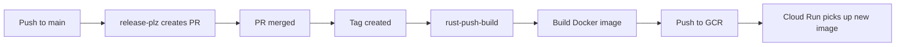

# Deployment & Infrastructure

**Version:** 0.3.5  
**Source:** `Dockerfile`, `build/dev/docker-compose.yml`, `build/release/docker-compose.yml`, `.github/workflows/*.yml`

---

## Goal

Package the application as a Docker container and deploy to Google Cloud Run. Automate build, push, and release via GitHub Actions.

---

## Docker

### Build (Multi-stage)

**Source:** `Dockerfile`

| Stage | Base Image | Purpose |
|-------|------------|---------|
| Builder | `rust:1.89.0-bookworm` | Compile release binary |
| Runtime | `gcr.io/distroless/cc-debian13:latest-amd64` | Minimal runtime |

**Build steps:**
```dockerfile
# Builder
COPY . .
RUN cargo build --release --locked

# Runtime
COPY --from=builder /app/target/release/husni-portfolio /husni-portfolio
COPY ./statics /statics
COPY ./version.json /version.json
CMD ["/husni-portfolio"]
```

**Notes:**
- `templates/` are NOT copied to runtime because Askama compiles templates at build time (via derive macro).
- `statics/` contains compiled CSS, favicons, and theme.js.
- `version.json` is read at runtime by the `/version` endpoint.

### Docker Compose (Dev)

**Source:** `build/dev/docker-compose.yml`

```yaml
services:
  husni-portfolio:
    image: "husni-portfolio:${SVC_VERSION}"
    environment:
      GOOGLE_APPLICATION_CREDENTIALS: /var/service_account.json
    env_file: ["../../.env"]
    ports: ["${SVC_PORT}:${SVC_PORT}"]
    volumes:
      - ./../../service_account.json:/var/service_account.json
```

### Docker Compose (Release)

**Source:** `build/release/docker-compose.yml`

```yaml
services:
  husni-portfolio:
    image: "gcr.io/husni-release/husni-portfolio:0.3.5"
    environment:
      GOOGLE_APPLICATION_CREDENTIALS: /var/service_account.json
    env_file: ["../../.release.env"]
    ports: ["8080:8080"]
    volumes:
      - ./../../release.service_account.json:/var/service_account.json
```

---

## Taskfile Commands

**Source:** `Taskfile.yml`

| Command | Description |
|---------|-------------|
| `task run` | Hot-reload: watches files, rebuilds TailwindCSS + cargo run |
| `task test` | Runs unit tests with `RUST_LOG=debug` and `--test-threads=1` |
| `task lint` | Runs `cargo clippy -- -D clippy::nursery` |
| `task fmt` | Runs `cargo fmt` |
| `task audit` | Runs `cargo deny check all` |
| `task coverage` | Runs `cargo tarpaulin` → HTML report |
| `task docker-build` | Builds Docker image with version tag |
| `task docker-run` | Runs Docker container |
| `task docker-compose-up` | Starts dev docker-compose |
| `task docker-compose-down` | Stops dev docker-compose |
| `task tailwind-build` | Compiles TailwindCSS |
| `task update-version` | Writes `version.json` from `Cargo.toml` + git hash + date |
| `task update-gcs-secret` | Updates Turso auth token in GCS bucket |

---

## GitHub Actions

### CI (`rust-ci.yml`)

**Trigger:** Push to non-main branches, PR open.  
**Paths:** `Cargo.toml`, `Cargo.lock`, `*.rs`, workflow file.

| Job | Tool | Command |
|-----|------|---------|
| `unit_test` | cargo | `cargo test --all-features --locked -- --test-threads=1` |
| `nextest_unit_test` | cargo-nextest | `cargo nextest run --locked` |
| `format` | cargo fmt | `cargo fmt --check` |
| `clippy` | cargo clippy | `cargo clippy --locked -- -D warnings` |
| `coverage` | cargo-tarpaulin | `cargo tarpaulin --ignore-tests --follow-exec --locked --coveralls $COVERALLS_REPO_TOKEN` |

**Environment:** Ubuntu 22.04, Rust 1.89.0, sccache, CARGO_INCREMENTAL=0.

### Push Build (`rust-push-build.yml`)

**Trigger:** Any tag push.

**Steps:**
1. Checkout code
2. Authenticate to GCP via `google-github-actions/auth@v3` using `SERVICE_ACCOUNT_KEY` secret
3. Build Docker image: `docker build -t husni-portfolio:$VERSION`
4. Configure Docker for GCR: `gcloud auth configure-docker`
5. Tag and push to `gcr.io/$GCP_PROJECT/husni-portfolio:$VERSION`

### Release (`rust-release.yml`)

**Trigger:** Push to `main` branch.

**Steps:**
1. Checkout with `fetch-depth: 0`
2. Install Rust 1.89.0
3. Run `release-plz/action@v0.5` with `command: release-pr`

**Permissions:** `contents: write`, `pull-requests: write`.

### Security Audit (`rust-audit.yml`)

**Trigger:** Weekly (Sunday midnight), push to non-main, PR open.

**Steps:**
1. Run `cargo deny check all --all-features --locked` via `EmbarkStudios/cargo-deny-action@v2`

---

## Deployment Flow



---

## Google Cloud Resources

| Resource | Purpose |
|----------|---------|
| GCR (`gcr.io/husni-release`) | Container registry |
| Cloud Run | Application hosting |
| Cloud Storage (GCS) | Secret storage (env vars) |
| Service Account | GCP authentication |

---

## Secrets Management

### Google Cloud Storage (GCS)

Secrets are stored as a key-value file in a GCS bucket:

| Secret Key | Description |
|------------|-------------|
| `JWT_SECRET` | JWT signing secret |
| `DATABASE_URL` | SQLite path or Turso URL |
| `TURSO_AUTH_TOKEN` | Turso database token |

**Env vars:**
- `SECRETS_BUCKET` — GCS bucket name
- `SECRETS_OBJECT` — Object path in bucket

**Source:** `src/config.rs:168-259`

### Service Account

| File | Environment |
|------|-------------|
| `service_account.json` | Development |
| `release.service_account.json` | Production |

Mounted as `/var/service_account.json` in Docker. Referenced via `GOOGLE_APPLICATION_CREDENTIALS`.

---

## Environment Variables

See [config-devops.md](config-devops.md) for the complete environment variable reference.

---

## Known Issues

1. **Hardcoded version in release compose**: `build/release/docker-compose.yml` has version `0.3.5` hardcoded.
2. **No health check endpoint**: Dockerfile has no `HEALTHCHECK` instruction.
3. **Service account in repo**: `service_account.json` and `release.service_account.json` are in the working tree (should be gitignored).
4. **No multi-arch build**: Dockerfile targets `amd64` only.
5. **No rollback strategy**: Cloud Run deployment is manual or via image tag; no automated rollback.
