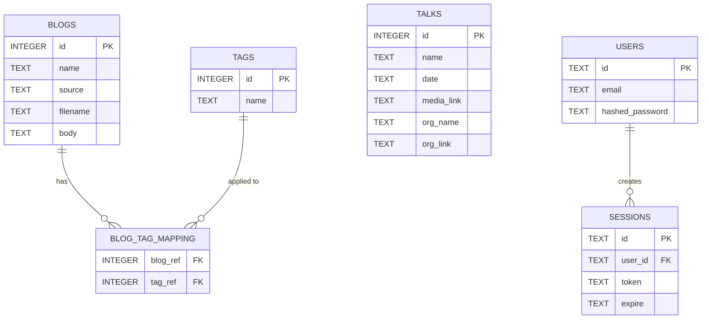

# Domain Model & Schema

**Version:** 0.3.5  
**Source:** `src/model/*.rs`, `src/database/turso/mod.rs`

---

## Goal

Define all domain entities, their fields, relationships, and the database schema that persists them.

---

## Entities

### Blog

The primary content unit. A blog entry with a markdown body rendered to HTML.

| Field | Type | Required | Description |
|-------|------|----------|-------------|
| `id` | `i64` | Yes | Primary key, auto-incremented |
| `name` | `Option<String>` | Yes* | Blog title |
| `source` | `Option<BlogSource>` | Yes* | Origin of the blog (Filesystem or Github) |
| `filename` | `Option<String>` | No | Filename or source reference |
| `body` | `Option<String>` | Yes* | Markdown content (rendered to HTML at template layer) |
| `tags` | `Option<Vec<String>>` | Yes* | Associated tag names, populated via JOIN |

> *Required at the application level but wrapped in `Option` to support partial data.

**Source:** `src/model/blogs.rs:57-64`

### BlogMetadata

A lightweight projection of Blog for list views. Omits body and source.

| Field | Type | Description |
|-------|------|-------------|
| `id` | `i64` | Blog ID |
| `name` | `String` | Blog title |
| `filename` | `String` | Filename |
| `tags` | `Vec<String>` | Tag names |

**Source:** `src/model/blogs.rs:142-148`

### BlogSource

Enum representing the origin of blog content.

| Variant | Description |
|---------|-------------|
| `Filesystem` | Blog markdown from local filesystem |
| `Github` | Blog markdown from GitHub repository (deprecated) |

**Source:** `src/model/blogs.rs:29-33`

> **Known issue:** `Github` variant is dead code. GitHub integration was removed in v0.2.x.

---

### Talk

A speaking engagement record.

| Field | Type | Required | Description |
|-------|------|----------|-------------|
| `id` | `i64` | Yes | Primary key |
| `name` | `String` | Yes | Talk title |
| `date` | `String` | Yes | Date string (YYYY-MM-DD) |
| `media_link` | `Option<String>` | No | URL to recording/video |
| `org_name` | `Option<String>` | No | Organisation name |
| `org_link` | `Option<String>` | No | Organisation URL |

**Source:** `src/model/talks.rs:18-25`

---

### Tag

A label applied to blogs for categorisation.

| Field | Type | Required | Description |
|-------|------|----------|-------------|
| `id` | `i64` | Yes | Primary key |
| `name` | `String` | Yes | Unique tag name |

**Source:** `src/model/tags.rs:13-16`

---

### BlogTagMapping

Many-to-many relationship between Blog and Tag.

| Field | Type | Description |
|-------|------|-------------|
| `blog_id` | `i64` | Foreign key to `blogs.id` |
| `tag_id` | `i64` | Foreign key to `tags.id` |

**Source:** `src/model/blog_tag_mappings.rs:9-12`

> **Note:** Database column names are `blog_ref` and `tag_ref`, not `blog_id`/`tag_id`.

---

### User

An admin account.

| Field | Type | Required | Description |
|-------|------|----------|-------------|
| `id` | `String` | Yes | User identifier (UUID-like) |
| `email` | `String` | Yes | Login email |
| `hashed_password` | `String` | Yes | Argon2 hashed password |

**Source:** `src/model/auth.rs:7-11`

---

### Session

A short-lived token tied to a User.

| Field | Type | Required | Description |
|-------|------|----------|-------------|
| `id` | `String` | Yes | Session identifier |
| `user_id` | `String` | Yes | Foreign key to `users.id` |
| `token` | `String` | Yes | JWT token |
| `expire` | `String` | Yes | Expiration timestamp |

**Source:** `src/model/auth.rs:14-19`

---

### Claims

JWT claims embedded in tokens.

| Field | Type | Description |
|-------|------|-------------|
| `exp` | `usize` | Expiration time (Unix timestamp) |
| `iat` | `usize` | Issued-at time (Unix timestamp) |

**Source:** `src/model/auth.rs:49-52`

---

### CommandStatus Enums

Each entity defines a `CommandStatus` enum indicating the outcome of write operations.

| Enum | Variants |
|------|----------|
| `BlogCommandStatus` | `Stored`, `Updated`, `Deleted`, `CacheInserted`, `CacheInvalidated` |
| `TalkCommandStatus` | `Stored`, `Updated`, `Deleted`, `CacheInserted`, `CacheInvalidated` |
| `TagCommandStatus` | `Stored`, `Updated`, `Deleted`, `CacheInserted`, `CacheInvalidated` |
| `BlogTagMappingCommandStatus` | `Stored`, `Updated`, `Deleted`, `CacheInserted`, `CacheInvalidated` |
| `UserCommandStatus` | `Stored`, `Updated`, `Deleted` |
| `SessionCommandStatus` | `Stored`, `Deleted` |

---

## Query Parameters

### BlogsParams

Used for `GET /blogs` and admin blog list endpoints.

| Field | Type | Default | Description |
|-------|------|---------|-------------|
| `start` | `Option<i64>` | `0` | Pagination start |
| `end` | `Option<i64>` | `100` | Pagination end |
| `tags` | `Option<String>` | `""` | Comma-separated tag names for filtering |

> **Known issue:** `sanitize()` at `src/model/blogs.rs:110` uses `self.end` instead of `self.start` for the start field fallback.

### TalksParams

Used for `GET /talks` and admin talk list endpoints.

| Field | Type | Default | Description |
|-------|------|---------|-------------|
| `start` | `Option<i64>` | `0` | Pagination start |
| `end` | `Option<i64>` | `100` | Pagination end |

### TagsListParams

Used for admin tag list endpoints.

| Field | Type | Default | Description |
|-------|------|---------|-------------|
| `start` | `Option<i64>` | `0` | Pagination start |
| `end` | `Option<i64>` | `100` | Pagination end |

### TagsSearchParams

Used for `GET /admin/blogs/tags/search`.

| Field | Type | Default | Description |
|-------|------|---------|-------------|
| `start` | `Option<i64>` | `0` | Pagination start |
| `end` | `Option<i64>` | `100` | Pagination end |
| `query` | `String` | — | Search term (sanitised to alphanumeric + whitespace) |

> **Known issue:** `sanitize()` at `src/model/tags.rs:124` has the same `self.end` bug as `BlogsParams`.

---

## Entity Relationship Diagram



---

## Database Schema

Defined inline in `src/database/turso/mod.rs:49-101`. Runs as `CREATE TABLE IF NOT EXISTS` on startup.

### blogs

```sql
CREATE TABLE IF NOT EXISTS blogs (
    id INTEGER PRIMARY KEY NOT NULL,
    name TEXT NOT NULL,
    source TEXT NOT NULL,
    filename TEXT NOT NULL,
    body TEXT NOT NULL
);
```

### talks

```sql
CREATE TABLE IF NOT EXISTS talks (
    id INTEGER PRIMARY KEY NOT NULL,
    name TEXT NOT NULL,
    date TEXT NOT NULL,
    media_link TEXT,
    org_name TEXT,
    org_link TEXT
);
```

### tags

```sql
CREATE TABLE IF NOT EXISTS tags (
    id INTEGER PRIMARY KEY NOT NULL,
    name TEXT NOT NULL
);
```

### blog_tag_mapping

```sql
CREATE TABLE IF NOT EXISTS blog_tag_mapping (
    blog_ref INTEGER NOT NULL,
    tag_ref INTEGER NOT NULL
);
```

> **Note:** No explicit primary key; composite key is `(blog_ref, tag_ref)`.

### users

```sql
CREATE TABLE IF NOT EXISTS users (
    id TEXT NOT NULL,
    email TEXT NOT NULL,
    hashed_password TEXT NOT NULL
);
```

### sessions

```sql
CREATE TABLE IF NOT EXISTS sessions (
    id TEXT NOT NULL,
    user_id TEXT NOT NULL,
    token TEXT NOT NULL,
    expire TEXT NOT NULL
);
```

---

## Template Models

Used by Askama for server-side rendering.

### Public Templates

| Struct | Template File | Fields |
|--------|---------------|--------|
| `ProfileTemplate` | `profile.html` | (none) |
| `BlogsTemplate` | `blogs.html` | `blogs: Vec<BlogMetadataTemplate>`, `active_tags: Vec<String>` |
| `BlogTemplate` | `blog.html` | `id`, `name`, `filename`, `body`, `tags` |
| `TalksTemplate` | `talks.html` | `talks: Vec<TalkTemplate>` |
| `VersionTemplate` | `version.html` | `version`, `environment`, `build_hash`, `build_date` |
| `LoginTemplate` | `auth/login.html` | (none) |
| `LoginRetryTemplate` | `auth/login_retry.html` | (none) |
| `LoginSuccessTemplate` | `auth/login_success.html` | (none) |
| `LogoutTemplate` | `auth/logout.html` | (none) |
| `UnauthorizedTemplate` | `statuses/401_unauthorized.html` | (none) |
| `NotFoundTemplate` | `statuses/404_not_found.html` | (none) |
| `IamATeapotTemplate` | `statuses/418_i_am_a_teapot.html` | (none) |
| `InternalServerErrorTemplate` | `statuses/500_internal_server_error.html` | (none) |

### Admin Templates

| Struct | Template File | Fields |
|--------|---------------|--------|
| `AdminTemplate` | `admin/admin.html` | (none) |
| `AdminTalksTemplate` | `admin/talks/talks.html` | (none) |
| `AdminListTalksTemplate` | `admin/talks/list_talks.html` | `talks: Vec<AdminTalkTemplate>` |
| `AdminGetTalkTemplate` | `admin/talks/get_talk.html` | `talk: AdminTalkTemplate` |
| `AdminGetAddTalkTemplate` | `admin/talks/get_add_talk.html` | `id`, `date` |
| `AdminGetEditTalkTemplate` | `admin/talks/get_edit_talk.html` | `talk: AdminTalkTemplate` |
| `AdminGetDeleteTalkTemplate` | `admin/talks/get_delete_talk.html` | `id` |
| `AdminBlogsTemplate` | `admin/blogs/blogs.html` | (none) |
| `AdminListBlogsTemplate` | `admin/blogs/list_blogs.html` | `blogs: Vec<BlogMetadataTemplate>`, `active_tags: Vec<String>` |
| `AdminGetBlogTemplate` | `admin/blogs/get_blog.html` | `blog: BlogMetadataTemplate` |
| `AdminGetAddBlogTemplate` | `admin/blogs/get_add_blog.html` | `id`, `avail_tags: Vec<String>` |
| `AdminGetEditBlogTemplate` | `admin/blogs/get_edit_blog.html` | `id`, `name`, `body`, `blog_tags`, `avail_tags` |
| `AdminGetDeleteBlogTemplate` | `admin/blogs/get_delete_blog.html` | `id` |
| `AdminBlogTagsTemplate` | `admin/blogs/tags/tags.html` | (none) |
| `AdminBlogTagsListTemplate` | `admin/blogs/tags/list_tags.html` | `tags: Vec<Tag>` |
| `AdminGetAddTagTemplate` | `admin/blogs/tags/get_add_tag.html` | `id` |
| `AdminGetTagTemplate` | `admin/blogs/tags/get_tag.html` | `id`, `name` |
| `AdminGetEditTagTemplate` | `admin/blogs/tags/get_edit_tag.html` | `id`, `name` |
| `AdminGetDeleteTagTemplate` | `admin/blogs/tags/get_delete_tag.html` | `id` |
