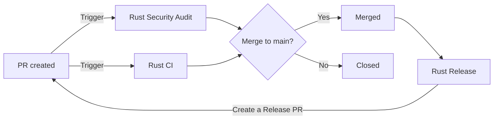

# Github Actions specification

## Goals
I want Github Actions to ease my development experience by handling test, security audit, testing, and release.

## Usage
- rust-audit: Do rust security audit when a new **PR** created or **scheduled**
- rust-ci: Do CI things when a new **PR** created
    - Linting
    - Formatting check
    - Unit Testing with cargo and nextest
    - Code coverage
- rust-push-build: Build docker image and push it to container registry when a new **tag** created
- rust-release: Bump, update changelog, and release a new version when a new **PR merged to main**

## Flow

### A new PR created


### A new tag created
```mermaid
flowchart LR
    A[Release PR] --> |Merged to main| B
    B[(Manually) Tag Created] --> |Trigger| C[Rust Push Build]
```

